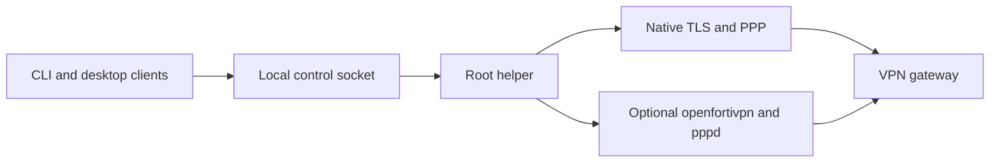

<p align="center">
  <picture>
    <source media="(prefers-color-scheme: dark)" srcset="docs/assets/readme-header-dark.png">
    
  </picture>
</p>

# fortix

FortiGate SSL VPN profile manager for macOS and Debian/Ubuntu. The CLI, macOS
menu-bar app, and Linux tray share a root helper with two selectable backends:
a native password-only client and optional
[openfortivpn](https://github.com/adrienverge/openfortivpn) for push or code-based
second factors.



## Features and status

- Named profiles, individual toggles, and several simultaneous tunnels when
  addresses and routes do not conflict.
- Password lookup and optional saving in the OS keychain, with hidden terminal
  or native desktop prompts when the keyring is unavailable.
- Native password-only tunnels without openfortivpn or pppd; optional FortiToken
  push and prompted codes through the openfortivpn backend.
- Custom IPv4 routes and split DNS, owned-resource cleanup, and helper recovery.
- Explicit certificate confirmation showing SHA-256, subject, and issuer.
- An arm64 macOS app with a profile editor, import preview, logs, installation,
  aggregate ring status, optional motion, and next-login autostart.
- A Linux system tray with notifications; the CLI works without a desktop client.

**Status: early development.** Automated tests exercise unprivileged fixtures;
real-gateway compatibility and clean-machine installation need verification
before production use. The native backend supports only password gateways,
not 2FA. There is no Windows, IPsec, SAML/SSO, client-certificate authentication,
DTLS, or IPv6 tunnel routing. Native PPP does not support PAP/CHAP or compression.
The schema accepts `totp` and `static` MFA modes, but clients currently prompt
for their codes; automatic seed/static-secret storage is not implemented.
The `preserve_lan` field defaults to true but does not yet install additional
LAN bypass routes. Use custom routing for predictable local-network access.

## Installation

Download the DMG, Debian package, or CLI archive for your OS and architecture
from [GitHub Releases](https://github.com/avhn/fortix/releases), together with
that release's `checksums.txt`. Verify the selected file **before** opening,
extracting, or installing it. See [release verification](docs/release.md#verify-a-download)
for exact checksum commands and the limits of a checksum from the same source.
Review the source before granting root access.

For a CLI archive, keep `fortix` and `fortix-helper` together: the installer
finds the CLI beside the helper. Extract each download into a new, empty
directory. For a source build, use the Go version in `go.mod` and build each executable:

```sh
GOMAXPROCS=2 GOFLAGS=-p=2 go build -o dist/fortix ./cmd/fortix
GOMAXPROCS=2 GOFLAGS=-p=2 go build -o dist/fortix-helper ./cmd/fortix-helper
GOMAXPROCS=2 GOFLAGS=-p=2 go build -o dist/fortix-tray ./cmd/fortix-tray
```

Build the macOS tray natively with cgo and Xcode Command Line Tools installed.
Linux tray builds do not require cgo. The helper installs its own root-owned
binaries under `/usr/local/libexec/fortix` and links the CLI into
`/usr/local/bin`; it does not install the tray. Keep the tray at a stable,
user-owned location before enabling autostart.

### macOS app

The DMG requires macOS 13 or later on Apple silicon (arm64). No Intel DMG is
provided; Intel users can use the CLI archive instead.

1. Verify the DMG, open it, and drag **Fortix.app** to **Applications**.
2. Eject the disk image and launch `/Applications/Fortix.app`. Do not install
   the helper from the mounted DMG or a build directory.
3. If Gatekeeper blocks this ad hoc signed, non-notarized app, review the
   download's provenance first. If you accept it, use **System Settings >
   Privacy & Security > Open Anyway**, then confirm opening it. Do not disable
   Gatekeeper globally or bypass your organization's policy.
4. Open **Settings and installation** and choose **Install helper...**. One
   administrator prompt copies the bundled CLI, helper, and pinentry from
   `Contents/Resources/libexec` into root-owned locations, creates the `fortix`
   group, enrolls the current desktop account with explicit `--user`, and loads
   the LaunchDaemon. Later connections do not require administrator prompts.
5. If socket access is refused after enrollment, log out and back in to refresh
   group membership, then reopen the app. Create or import a profile and connect.

Password-only profiles need no additional VPN executable. For push or codes,
install openfortivpn separately, then choose **Add 2FA support...** in the app
and select that binary. This explicit operation requires its own administrator
prompt and copies the optional backend without restarting the helper. Select
`openfortivpn`, or **Automatic** with a non-`none` MFA mode, in the profile editor.
The app does not bundle openfortivpn, and adding it does not enable native 2FA.

### macOS CLI installation

For a verified CLI archive or source build, native support installs without
openfortivpn:

```sh
sudo ./fortix-helper install
```

The installer loads `com.github.avhn.fortix.helper`, creates the `fortix` group,
and enrolls `SUDO_USER`. If needed, `--user` explicitly selects an existing
non-root desktop account. Log out and back in to refresh group membership.

To add the optional MFA backend to an existing installation:

```sh
brew install openfortivpn
sudo /usr/local/libexec/fortix/fortix-helper install --add-openfortivpn \
  --openfortivpn "$(brew --prefix)/bin/openfortivpn"
```

The installer copies openfortivpn and its non-system dylibs to
`/Library/Application Support/fortix/libexec`, rewrites load paths with
`install_name_tool`, and signs the copies ad hoc. A root helper never executes
a user-writable package-manager binary or loads its user-writable libraries
directly. CLI archives are not Developer ID signed or notarized either.

### Debian/Ubuntu

Use a systemd host with `iproute2` and `/dev/net/tun` for native tunnels.
After checksum verification, install the `.deb` without its optional MFA
recommendations. In a directory containing only your selected package:

```sh
sudo apt install --no-install-recommends ./fortix_*.deb
sudo usermod -aG fortix "$(id -un)"
```

Run these as the intended desktop account with sudo, not from a root login.
The package depends on `iproute2` and only **recommends** `openfortivpn` and
`ppp`. Ordinary apt installs may include recommendations; the command above
avoids requiring those programs for password-only native profiles. The package
starts `fortix-helper.service` but does not enroll desktop users automatically.
Log out and back in after group enrollment. Packaged binaries live in
`/usr/libexec/fortix`; do not mix package ownership with the archive installer.

For an archive/source installation instead:

```sh
sudo apt install iproute2
sudo ./fortix-helper install
```

This creates the group, enrolls `SUDO_USER` (or an explicit `--user`), and
enables the helper service. Native profiles do not use pppd. Install
`openfortivpn` and `ppp` separately if you select the openfortivpn backend.
For split DNS, configure a working systemd-resolved installation with
`resolvectl`; it is not a package dependency and there is no automatic
resolvconf fallback. `dns.mode: none` needs no managed split DNS.

The Linux tray uses StatusNotifierItem over D-Bus. KDE and XFCE usually expose
it directly; GNOME requires an AppIndicator-compatible extension. Without a
StatusNotifier host or working session D-Bus, no icon appears and the tray may
continue running invisibly. Use the CLI in that environment. Hidden
prompts require `zenity` or `kdialog`, and notifications use `notify-send`.
On macOS these use `osascript`.

## Quick start

Create `work.json` with a secret-free profile. Replace the reserved example
host/domain, illustrative private subnet, and `YOUR_VPN_USERNAME` with your
administrator-provided settings, never a password:

```json
{
  "schema_version": 1,
  "id": "work",
  "name": "Work",
  "backend": "native",
  "gateway": { "host": "vpn.example.com", "port": 443 },
  "username": "YOUR_VPN_USERNAME",
  "mfa": { "mode": "none" },
  "routes": { "mode": "custom", "include": ["10.20.0.0/16"], "preserve_lan": true },
  "dns": { "mode": "split", "domains": ["corp.example.com"] }
}
```

```sh
fortix profile validate work.json
fortix profile add work.json
fortix up work
fortix status
fortix down work
```

If the gateway's certificate is rejected, verify its identity with your
administrator over an independent channel, then use `fortix trust work`.
Trusting an unexpected digest without verification can expose credentials.
See [profiles](docs/profiles.md) for the complete schema and routing policy.

### Backend selection

| Profile setting | Selected backend |
| --- | --- |
| Omitted `backend`, `mfa.mode: none` (also the MFA default) | `native` |
| Omitted `backend`, any other supported MFA mode | `openfortivpn` |
| Explicit `native` | Valid only with `mfa.mode: none` |
| Explicit `openfortivpn` | Kept, including for password-only profiles |

Schema version remains `1`. Existing stored explicit choices are not migrated;
FortiClient imports omit the backend so MFA selection can determine it. There
is no silent backend fallback if an executable is missing or authentication
fails. An unexpected second-factor challenge on native fails with a message to
use openfortivpn. Disconnect, edit the inactive profile, and reconnect explicitly.

## CLI reference

| Command | Behavior |
| --- | --- |
| `fortix version` | Print the binary version |
| `fortix profile validate <file>` | Validate local JSON without a helper |
| `fortix profile list` | List stored profile IDs and states |
| `fortix profile show <id>` | Show stored JSON |
| `fortix profile add <file>` | Validate and store through the helper |
| `fortix profile export <id>... [-o FILE] [--force]` | Export shared JSON without usernames or passwords; refuse existing output files unless forced |
| `fortix profile import FILE [--username NAME] [--id ID] [--name NAME] [--merge ID] [--yes]` | Complete shared drafts or merge into an existing profile, keeping its username |
| `fortix profile rm <id>` or `fortix profile remove <id>` | Remove an inactive profile |
| `fortix import forticlient [--plist path] [--apply]` | Preview non-secret drafts; optionally store them |
| `fortix password set\|clear <id>` | Store a hidden password in, or remove it from, the keyring |
| `fortix up <id>...\|--all [--save]` | Wait for connection outcomes and answer challenges |
| `fortix down <id>...\|--all` | Wait up to 30 seconds for selected tunnels to stop and finish cleanup |
| `fortix status [--json]` | Show the helper's current snapshot |
| `fortix logs <id> [--lines 1..500]` | Print bounded, redacted diagnostics |
| `fortix trust <id> [--yes]` | Capture rejected certificate identity, confirm trust, and connect |

Shared import accepts `-` for stdin and imports every profile in a file.
`--id`, `--name`, and `--merge` require a single-profile file. New IDs must not
already exist. Missing fields are prompted only on a terminal; otherwise supply
complete shared configuration and `--username`. Import never asks for a password.
Run `fortix up <id> --save` afterward to connect and optionally save it to the keychain.
Shared pins are displayed and require confirmation, or `--yes` noninteractively.
Verify the sender and pin independently. The helper ignores submitted pins on
import, just as with `profile add`; use `fortix trust <id>` to establish trust.

Use `--help` for command-specific flags. `--yes` skips the confirmation prompt;
it does not bypass the helper's captured-digest check. Passwords are saved only
after successful connection when `--save` or `remember_passwords` is enabled.
To retry an incorrect cached password in the CLI, first run
`fortix password clear <id>`. After a failed attempt using a saved password,
the tray bypasses that password and prompts on the next attempt. A successful
remembered replacement restores keyring use; restarting the tray resets the
bypass, so clear the saved password if it should not be used again.

## macOS app, tray, and preferences

The macOS app's **Profiles** window offers new/edit/delete, read-only import
preview, connect/disconnect, and **Forget password**. **Logs** displays a bounded
redacted tail. **Settings and installation** controls icon motion and
**Launch Fortix at login** through the OS login-item service; approve it in
System Settings when requested. Do not enable both app and legacy-tray autostart.
Password saving in the app is an explicit checkbox on the password sheet and
happens only after that attempt connects; CLI and app share compatible Keychain
entries. Clear an incorrect saved password before retrying.

Both CLI `down` and the macOS app wait for authoritative snapshots showing every
target as disconnected, unwanted, and free of pending cleanup, under a 30-second
budget. A request acknowledgement alone is not completion. Timeout, helper loss,
cleanup failure, or a competing start is reported as failure; check `fortix status`
and logs rather than assuming the host has been restored. Quitting either desktop
client does not disconnect helper-owned tunnels. The socket protocol remains
asynchronous; other clients must implement their own completion wait.

### Legacy Go tray

Start `fortix-tray` as your desktop user, never as root. The **Profiles** menu
contains a checkbox for each profile with readable state text. Click it to
connect or stop its current attempt. **Connect all** starts inactive profiles,
**Disconnect all** stops all tunnels, and **Open logs** fetches up to 500
redacted lines from the helper and opens a private `0600` snapshot with `open`
or `xdg-open`. Snapshots are kept in a private user temporary directory until
the tray exits. Quit closes the tray client but does not stop helper-owned
connected tunnels. The tray reconnects with bounded backoff if
the helper restarts, without automatically starting stopped profiles.

The ring glyph uses shape as well as color; macOS uses a template icon that
adapts to menu-bar appearance. Colors apply only to Linux; macOS conveys
status through glyph shape, not grey, amber, or green:

| Status | Meaning |
| --- | --- |
| NotConnected | No wanted connection, progress, or attention, grey on Linux |
| Connecting | No wanted profile is connected; a profile is progressing without needing human attention |
| Connected | At least one profile is wanted and all wanted profiles are connected, green on Linux |
| Partial | At least one wanted profile is connected and at least one wanted profile is not connected |
| Attention | No wanted profile is connected and a failed profile, password prompt, or certificate needs attention |

A profile is wanted after a tray or CLI start until explicitly stopped, including
failed attempts. Refresh takes this intent from current helper state. Partial
takes precedence over connecting and attention when wanted connectivity is mixed;
Connected means every wanted profile is connected. Unwanted idle profiles do not
make a connected set partial. Plain `fortix status` includes failure details.
The tray offers **Forget saved password** for each profile.

Linux progress and attention states use amber; partial connectivity uses a
green partial ring. The tooltip lists
connected profiles and reports helper unavailability. Connecting can animate
only when both **Animate icon** and the desktop motion setting permit it;
unknown motion policy disables animation. The checkbox persists and takes
effect live. Optional notifications cover connect, disconnect, and failure.

User preferences are `~/Library/Application Support/fortix/config.json` on
macOS and `$XDG_CONFIG_HOME/fortix/config.json` on Linux (default
`~/.config/fortix/config.json`). The directory is private and the file is
`0600`. Missing values default to true:

```json
{ "remember_passwords": true, "animate_icon": true, "notifications": true }
```

```sh
fortix-tray autostart enable
fortix-tray autostart disable
```

These write/remove an owned LaunchAgent or XDG autostart entry; they take
effect on the next desktop login. Disabling autostart does not stop a running
tray, and neither operation starts or stops the root helper.

## Several profiles at once

Each profile has an independent native session or openfortivpn process. Custom
CIDRs are checked against other attempts, existing routes, and connected subnets.
Native pushed routes are reserved before route installation. Openfortivpn's
stdout and stderr route failures, including an existing-route clash, are typed
failures rather than a successful connection. It may still have installed some
routes before detection; conflict checks do not prevent every transient change.
Duplicate tunnel IPv4 addresses are refused. Ask administrators for distinct
address pools; changing routes alone does not fix duplicate local addresses.

`gateway` uses pushed IPv4 routes but rejects ordinary and split defaults.
`custom` uses only the included prefixes. Native `full` uses pushed routes;
when no split routes are supplied, or defaults are pushed, it installs two
owned /1 routes plus a physical-link exception for the actual gateway IPv4
address. The openfortivpn backend follows upstream route handling and does not
synthesize this native full-mode fallback. Only one full tunnel can be reserved.
Split DNS manages only the profile's listed domains, not every gateway suffix.
See [routing and DNS](docs/profiles.md#routes-and-dns-behavior) for details.

IPv6 may continue outside the VPN. There is no kill switch or universal
DNS/leak-prevention guarantee, and `preserve_lan` alone does not add bypass routes.

## Security model

The CLI, app, and tray are unprivileged. Only the helper runs native TLS/PPP,
starts trusted optional executables, and changes owned network resources. The Unix control socket is `root:fortix
0660`, with peer-credential checks. Membership grants management of **all**
profiles, not per-user isolation. Profile JSON cannot express arbitrary
commands, options, or passwords. Secrets travel through the local socket into
the selected backend (through an attempt-bound pinentry relay for openfortivpn),
not files, argv, or child environment variables. Gateway trust accepts a valid
system chain and hostname **or** the saved leaf DER SHA-256 pin. A pin is an
alternative to PKI, not an extra restriction on otherwise valid certificates.
See [security](docs/security.md) for the trust boundary and disclosure process.

## Uninstall

For the macOS app, use **Uninstall helper...** in **Settings and installation**.
It waits for clean disconnection, disables app login startup when enabled, and
removes the helper without purging profiles or Keychain entries. Quit and move
Fortix.app to the Trash afterward.

For CLI/tray installations, run `fortix down --all`, check that it succeeds,
then disable tray autostart and quit it. For an archive/source installation:

```sh
sudo /usr/local/libexec/fortix/fortix-helper uninstall
# Also delete stored profiles:
sudo /usr/local/libexec/fortix/fortix-helper uninstall --purge
```

The helper stops the service and removes owned resources and installed files;
profiles remain unless `--purge`. User preferences, keychain passwords, and
your separately installed tray are not removed. Clear passwords with
`fortix password clear <id>` before uninstalling if desired. For a Debian
package, use `apt remove fortix` or `apt purge fortix` instead of the helper
uninstaller. Remove any tray binary you copied manually.

## Development and license

See [CONTRIBUTING](CONTRIBUTING.md) for the local gate and build matrix,
[protocol](docs/protocol.md) for native gateway and local control flows, and
[release](docs/release.md) for artifact contents, verification, and packaging checks.
Copyright (C) 2026 Mert Dede.

fortix is free software: you can redistribute it and/or modify it under the
terms of the GNU General Public License as published by the Free Software
Foundation, either version 3 of the License, or (at your option) any later
version (`GPL-3.0-or-later`). It is distributed in the hope that it will be
useful, but WITHOUT ANY WARRANTY; see [LICENSE](LICENSE) for details.

fortix is an independent open source project. It is not affiliated with or
endorsed by Fortinet. FortiGate and FortiClient are trademarks of Fortinet, Inc.,
used here only to describe compatibility.

openfortivpn, which fortix drives as a separate program, is also GPL-3.0
licensed. Packages that bundle it ship its license, the licenses of its bundled
libraries, and a pointer to the exact source they were built from.
