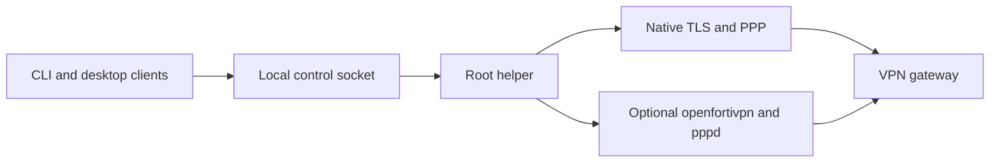

<p align="center">
  <picture>
    <source media="(prefers-color-scheme: dark)" srcset="docs/assets/readme-header-dark.png">
    
  </picture>
</p>

# fortix

FortiGate SSL VPN profile manager for macOS, Debian/Ubuntu, and Windows
(preview). The CLI, macOS menu-bar app, Linux tray, and Windows desktop app share
a privileged helper with two selectable backends: a native password-only client
and, on macOS and Linux, optional
[openfortivpn](https://github.com/adrienverge/openfortivpn) for push or code-based
second factors.



## Features and status

- Named profiles, individual toggles, and several simultaneous tunnels when
  addresses and routes do not conflict.
- Password lookup and optional saving in the OS keychain, with hidden terminal
  or native desktop prompts when the keyring is unavailable.
- Native password-only tunnels without openfortivpn or pppd; optional FortiToken
  push and prompted codes through the openfortivpn backend.
- Custom IPv4 routes and split DNS, owned-resource cleanup, and helper recovery.
- Shareable profile files without usernames or passwords, with partial import,
  merge, and editable route and DNS lists in the app.
- Explicit certificate confirmation showing SHA-256, subject, and issuer.
- An arm64 macOS app with a profile editor, import preview, logs, installation,
  aggregate ring status, optional motion, and next-login autostart.
- A Linux system tray with notifications; the CLI works without a desktop client.
- A Windows preview: a native desktop app with a notification-area icon, profile
  editor, logs, and Credential Manager passwords, plus the CLI and a helper
  service using Wintun, IP Helper routes, and NRPT split DNS. See
  [Windows](docs/windows.md).

**Status: beta.** fortix has been used daily against real FortiGate gateways on
macOS and tested end to end on Debian in a container, with two tunnels up at
once. Windows support is a preview: it is tested end to end in CI against a
local test gateway, ships unsigned, and supports only the native backend. The
native backend supports only password gateways, not 2FA; use the
openfortivpn backend for push or codes. There is no IPsec, SAML/SSO,
client-certificate authentication, DTLS, or IPv6 tunnel routing. Native PPP
does not support PAP/CHAP or compression. The schema accepts `totp` and
`static` MFA modes, but clients currently prompt for their codes; automatic
seed/static-secret storage is not implemented. With the native backend,
`preserve_lan` (default true) keeps local networks out of gateway-pushed routes,
and `routes.exclude` leaves listed ranges out of them so two VPNs that push the
same network can run together; the openfortivpn backend applies neither.

## Where your password is stored

fortix never stores your VPN password itself: not in the app, not in profile
files, and not on disk. When you choose to save it, it goes into your operating
system's own credential store, under your user account:

| Platform | Stored in |
| --- | --- |
| macOS | Keychain (visible in **Keychain Access**), shared by the app and the CLI |
| Debian/Ubuntu | Desktop keyring through the Secret Service (GNOME Keyring or KWallet) |
| Windows | Credential Manager (**Windows Credentials**) |

Saving is optional and happens only after a successful connection. If you do
not save it, or the keyring is unavailable, fortix asks for the password each
time. Profiles and exported profile files carry no passwords, and **Forget
password** in the app or `fortix password clear <id>` removes the saved entry.

## Installation

| Platform | Recommended | Alternatives |
| --- | --- | --- |
| macOS 13+ on Apple silicon | Homebrew cask (app) | DMG download, Homebrew formula (CLI only) |
| macOS on Intel | Homebrew formula (CLI) | CLI archive |
| Debian/Ubuntu amd64 or arm64 | apt repository | `.deb` download, Homebrew formula |
| Windows 10 22H2 or 11, x64 (preview) | Release ZIP | None yet |

Every channel installs the same binaries. Review the source before granting
root access: the helper runs as root (LocalSystem on Windows).

### Homebrew

Most macOS users want the app. Install it with the cask; note the `--cask`
flag:

```sh
# Fortix.app in /Applications (arm64 macOS 13 or later)
brew install --cask avhn/tap/fortix
```

The cask installs only the app. Open `/Applications/Fortix.app`, then go to
**Settings and installation** and choose **Install helper...**; the app cannot
connect until the helper is installed. One administrator prompt sets it up, and
later connections need no prompt.

Without `--cask`, `brew install avhn/tap/fortix` installs the formula instead:
the `fortix` CLI and `fortix-helper` only, with no app in `/Applications`. Use
it on Intel Macs, on Linux, or when you only want the command line:

```sh
# CLI and helper only (macOS or Linux, amd64 or arm64)
brew install avhn/tap/fortix
sudo "$(brew --prefix)/bin/fortix-helper" install
```

fortix is free, open source software and is not signed with a paid Apple
Developer ID certificate or notarized by Apple. The app is ad hoc signed
instead, so macOS blocks the first launch with a warning that it cannot verify
the developer. This is expected; the source and the release checksums are
public, so you can review and verify what you run. After deciding to trust this
release, open the app once, then go to **System Settings > Privacy & Security**
and click **Open Anyway** next to the Fortix message. Alternatively, clear the
quarantine flag for this app only:

```sh
xattr -dr com.apple.quarantine /Applications/Fortix.app
```

Do not disable Gatekeeper globally. Then install the helper from the app as
described above ([macOS app](#macos-app), step 4). The formula's
`fortix-helper install` copies the binaries into root-owned locations and does
not run them from the Homebrew prefix.

`brew upgrade` updates the app or CLI, but not the root-owned helper copies.
Afterwards run the `install` command again, or choose **Install helper...** in
the app. Reinstalling restarts the helper, which drops connected tunnels, so
disconnect first.

### Debian and Ubuntu (apt)

The repository at <https://avhn.github.io/fortix/apt> is signed by a dedicated
key with fingerprint `7F1D1CA8B09790EAC0FA70DA1A52C72D8C1F6F06`. This adds the
key scoped to that repository only, after checking the fingerprint, and
installs fortix without the optional 2FA programs:

```sh
sudo apt-get update && sudo apt-get install --yes ca-certificates curl gnupg
(
  set -eu
  KEYDIR="$(mktemp -d)"; trap 'rm -rf "$KEYDIR"' EXIT
  curl -fsSL https://avhn.github.io/fortix/apt/fortix-archive-keyring.gpg -o "$KEYDIR/key.gpg"
  FINGERPRINT="$(gpg --batch --with-colons --show-keys "$KEYDIR/key.gpg" | awk -F: '$1 == "fpr" { print $10; exit }')"
  test "$FINGERPRINT" = 7F1D1CA8B09790EAC0FA70DA1A52C72D8C1F6F06
  sudo install -D -m 0644 "$KEYDIR/key.gpg" /etc/apt/keyrings/fortix-archive-keyring.gpg
  echo 'deb [signed-by=/etc/apt/keyrings/fortix-archive-keyring.gpg] https://avhn.github.io/fortix/apt stable main' \
    | sudo tee /etc/apt/sources.list.d/fortix.list >/dev/null
)
sudo apt-get update
sudo apt-get install --yes --no-install-recommends fortix
sudo usermod -aG fortix "$(id -un)"
```

Log out and back in so the group membership applies. `apt-get upgrade` keeps
fortix current. Drop `--no-install-recommends` to also pull in `openfortivpn`
and `ppp` for second-factor gateways. Never work around a signature failure
with `trusted=yes` or `--allow-unauthenticated`.

The package depends on `iproute2` and needs a systemd host with `/dev/net/tun`.
It starts `fortix-helper.service` but does not enroll desktop users itself.
Split DNS needs a working systemd-resolved: `/etc/resolv.conf` must point at
its stub (`127.0.0.53`) or the host must use `nss-resolve`, otherwise internal
names will not resolve even though the tunnel is up. Check with
`resolvectl query <internal-host>`. `dns.mode: none` needs neither.

### Direct downloads

Each [GitHub release](https://github.com/avhn/fortix/releases) carries the
DMG, `.deb` packages, CLI archives, the Windows ZIP, and `checksums.txt`. Verify a download
before opening it:

```sh
shasum -a 256 --check --ignore-missing checksums.txt   # macOS
sha256sum --check --ignore-missing checksums.txt       # Linux
```

A checksum from the same page only detects corruption, not a compromised
release; see [release verification](docs/release.md#verify-a-download). Install
a `.deb` with `sudo apt install --no-install-recommends ./fortix_*.deb`, then add
yourself to the `fortix` group as above. From a CLI archive, keep `fortix` and
`fortix-helper` together and run `sudo ./fortix-helper install`; it creates the
`fortix` group and enrolls `SUDO_USER` (or `--user NAME`). Do not mix the
archive installer with the Debian package on one machine.

### Windows (preview)

Download `fortix_<version>_windows_amd64.zip` and `checksums.txt`, verify the
ZIP with `Get-FileHash`, and extract it. Then, in an elevated PowerShell inside
the extracted folder:

```powershell
.\fortix-helper.exe install --user $env:USERNAME
```

Sign out and back in for the `fortix` group membership, then start
`FortixApp.exe` or use `fortix.exe`. As an open source project without a paid
code-signing certificate, the executables are unsigned, so SmartScreen warns on
first launch; choose **More info > Run anyway** after verifying the checksum. Windows supports only native password-only
profiles; openfortivpn, MFA profiles, and FortiClient import are unavailable.
Uninstall with `fortix-helper.exe uninstall` (add `--purge` to remove profiles).
[Windows](docs/windows.md) covers verification, security, DNS, and recovery.

### From source

Use the Go version in `go.mod`:

```sh
GOMAXPROCS=2 GOFLAGS=-p=2 go build -o dist/fortix ./cmd/fortix
GOMAXPROCS=2 GOFLAGS=-p=2 go build -o dist/fortix-helper ./cmd/fortix-helper
sudo ./dist/fortix-helper install
```

`scripts/build-macos-app.sh` builds the app bundle and DMG; see
[CONTRIBUTING](CONTRIBUTING.md) for the full build matrix and the legacy tray.

### macOS app

The DMG requires macOS 13 or later on Apple silicon (arm64). No Intel DMG is
provided; Intel users can use the CLI archive instead.

1. Install with the cask, or verify the DMG, open it, and drag **Fortix.app**
   to **Applications**.
2. Eject any disk image and launch `/Applications/Fortix.app`. Do not install
   the helper from the mounted DMG or a build directory.
3. If Gatekeeper blocks this ad hoc signed, non-notarized app, review the
   download's provenance first. If you accept it, use **System Settings >
   Privacy & Security > Open Anyway**, or the `xattr` command above. Do not
   disable Gatekeeper globally or bypass your organization's policy.
4. Open **Settings and installation** and choose **Install helper...**. One
   administrator prompt copies the bundled CLI, helper, and pinentry from
   `Contents/Resources/libexec` into root-owned locations, creates the `fortix`
   group, enrolls the current desktop account with explicit `--user`, and loads
   the LaunchDaemon. Later connections do not require administrator prompts.
5. If socket access is refused after enrollment, log out and back in to refresh
   group membership, then reopen the app. Create or import a profile and connect.

Password-only profiles need no additional VPN executable. For push or codes,
install openfortivpn separately, then choose **Add 2FA support...** in the app
and select that binary. This explicit operation requires its own administrator
prompt and copies the optional backend without restarting the helper. Select
`openfortivpn`, or **Automatic** with a non-`none` MFA mode, in the profile editor.
The app does not bundle openfortivpn, and adding it does not enable native 2FA.

### Second-factor support (openfortivpn)

Native profiles need no other VPN program. For push or code-based 2FA on
macOS, install openfortivpn and hand a root-owned copy to the helper:

```sh
brew install openfortivpn
sudo /usr/local/libexec/fortix/fortix-helper install --add-openfortivpn \
  --openfortivpn "$(brew --prefix)/bin/openfortivpn"
```

The installer copies openfortivpn and its non-system libraries to
`/Library/Application Support/fortix/libexec` and signs the copies ad hoc, so
the root helper never runs a user-writable binary. On Debian, install the
`openfortivpn` and `ppp` packages. Then select `openfortivpn`, or leave the
backend unset with a non-`none` MFA mode, in the profile.

### Linux tray

The Linux tray uses StatusNotifierItem over D-Bus. KDE and XFCE usually expose
it directly; GNOME requires an AppIndicator-compatible extension. Without a
StatusNotifier host or working session D-Bus, no icon appears and the tray may
continue running invisibly. Use the CLI in that environment. Hidden
prompts require `zenity` or `kdialog`, and notifications use `notify-send`.
On macOS these use `osascript`.

## Quick start

Create `work.json` with a secret-free profile. Replace the reserved example
host/domain, illustrative private subnet, and `YOUR_VPN_USERNAME` with your
administrator-provided settings, never a password:

```json
{
  "schema_version": 1,
  "id": "work",
  "name": "Work",
  "backend": "native",
  "gateway": { "host": "vpn.example.com", "port": 443 },
  "username": "YOUR_VPN_USERNAME",
  "mfa": { "mode": "none" },
  "routes": { "mode": "custom", "include": ["10.20.0.0/16"], "preserve_lan": true },
  "dns": { "mode": "split", "domains": ["corp.example.com"] }
}
```

```sh
fortix profile validate work.json
fortix profile add work.json
fortix up work
fortix status
fortix down work
```

If the gateway's certificate is rejected, verify its identity with your
administrator over an independent channel, then use `fortix trust work`.
Trusting an unexpected digest without verification can expose credentials.
See [profiles](docs/profiles.md) for the complete schema and routing policy.

### Backend selection

| Profile setting | Selected backend |
| --- | --- |
| Omitted `backend`, `mfa.mode: none` (also the MFA default) | `native` |
| Omitted `backend`, any other supported MFA mode | `openfortivpn` |
| Explicit `native` | Valid only with `mfa.mode: none` |
| Explicit `openfortivpn` | Kept, including for password-only profiles |

Schema version remains `1`. Existing stored explicit choices are not migrated;
FortiClient imports omit the backend so MFA selection can determine it. There
is no silent backend fallback if an executable is missing or authentication
fails. An unexpected second-factor challenge on native fails with a message to
use openfortivpn. Disconnect, edit the inactive profile, and reconnect explicitly.

## Sharing profiles

A colleague who already uses fortix can export a profile and send you the file.
The export carries the gateway, routes, split DNS domains, and backend, but
never a username or password, so everyone signs in with their own account.

```sh
fortix profile export work -o work.fortix.json      # sender
fortix profile import work.fortix.json --username YOUR_VPN_USERNAME
fortix up work --save                               # asks for your password once
```

On a terminal, import asks for anything the file lacks. In the macOS app,
**Import profile...** opens each profile in the editor with the file's values
filled in; enter your username, add or remove route and DNS rows with **+** and
**-**, and save. **Export...** writes the selected profile, or all of them.

To extend a profile later, for example when the VPN starts serving another
internal domain, add the domain or prefix to the profile's lists (in the app's
editor, or in a file merged with `--merge`). A wildcard such as
`*.example-internal.com` is accepted and stored as the domain itself, which
already covers every name under it:

```sh
fortix profile import extra.fortix.json --merge work
```

A merge keeps your ID and username and replaces only the fields present in the
file; a list in the file replaces that list as a whole. If a merge would change
the gateway, fortix shows the change and asks first, because your password goes
to whichever gateway the profile names. Files containing anything that looks
like a password, token, or cookie are rejected outright. A certificate
fingerprint inside a file is shown but never trusted automatically; see
[sharing profiles](docs/profiles.md) for the format.

## CLI reference

| Command | Behavior |
| --- | --- |
| `fortix version` | Print the binary version |
| `fortix profile validate <file>` | Validate local JSON without a helper |
| `fortix profile list` | List stored profile IDs and states |
| `fortix profile show <id>` | Show stored JSON |
| `fortix profile add <file>` | Validate and store through the helper |
| `fortix profile export <id>... [-o FILE] [--force]` | Export shared JSON without usernames or passwords; refuse existing output files unless forced |
| `fortix profile import FILE [--username NAME] [--id ID] [--name NAME] [--merge ID] [--yes]` | Complete shared drafts or merge into an existing profile, keeping its username |
| `fortix profile rm <id>` or `fortix profile remove <id>` | Remove an inactive profile |
| `fortix import forticlient [--plist path] [--apply]` | Preview non-secret drafts; optionally store them |
| `fortix password set\|clear <id>` | Store a hidden password in, or remove it from, the keyring |
| `fortix up <id>...\|--all [--save]` | Wait for connection outcomes and answer challenges |
| `fortix down <id>...\|--all` | Wait up to 30 seconds for selected tunnels to stop and finish cleanup |
| `fortix status [--json]` | Show the helper's current snapshot |
| `fortix logs <id> [--lines 1..500]` | Print bounded, redacted diagnostics |
| `fortix trust <id> [--yes]` | Capture rejected certificate identity, confirm trust, and connect |

Shared import accepts `-` for stdin and imports every profile in a file.
`--id`, `--name`, and `--merge` require a single-profile file. New IDs must not
already exist. Missing fields are prompted only on a terminal; otherwise supply
complete shared configuration and `--username`. Import never asks for a password.
Run `fortix up <id> --save` afterward to connect and optionally save it to the keychain.
A merge that changes the gateway needs confirmation, or `--yes` noninteractively.
A certificate fingerprint in the file is printed as unverified information and
never saved; use `fortix trust <id>` after confirming the fingerprint with your
administrator.

Use `--help` for command-specific flags. `--yes` skips the confirmation prompt;
it does not bypass the helper's captured-digest check. Passwords are saved only
after successful connection when `--save` or `remember_passwords` is enabled.
To retry an incorrect cached password in the CLI, first run
`fortix password clear <id>`. After a failed attempt using a saved password,
the tray bypasses that password and prompts on the next attempt. A successful
remembered replacement restores keyring use; restarting the tray resets the
bypass, so clear the saved password if it should not be used again.

## macOS app, tray, and preferences

The macOS app's **Profiles** window offers new/edit/delete, profile import and
export, a read-only FortiClient import preview, connect/disconnect, and
**Forget password**. **Logs** displays a bounded
redacted tail. **Settings and installation** controls icon motion and
**Launch Fortix at login** through the OS login-item service; approve it in
System Settings when requested. Do not enable both app and legacy-tray autostart.
Password saving in the app is an explicit checkbox on the password sheet and
happens only after that attempt connects; CLI and app share compatible Keychain
entries. Clear an incorrect saved password before retrying.

Both CLI `down` and the macOS app wait for authoritative snapshots showing every
target as disconnected, unwanted, and free of pending cleanup, under a 30-second
budget. A request acknowledgement alone is not completion. Timeout, helper loss,
cleanup failure, or a competing start is reported as failure; check `fortix status`
and logs rather than assuming the host has been restored. Quitting either desktop
client does not disconnect helper-owned tunnels. The socket protocol remains
asynchronous; other clients must implement their own completion wait.

### Legacy Go tray

Start `fortix-tray` as your desktop user, never as root. The **Profiles** menu
contains a checkbox for each profile with readable state text. Click it to
connect or stop its current attempt. **Connect all** starts inactive profiles,
**Disconnect all** stops all tunnels, and **Open logs** fetches up to 500
redacted lines from the helper and opens a private `0600` snapshot with `open`
or `xdg-open`. Snapshots are kept in a private user temporary directory until
the tray exits. Quit closes the tray client but does not stop helper-owned
connected tunnels. The tray reconnects with bounded backoff if
the helper restarts, without automatically starting stopped profiles.

The ring glyph uses shape as well as color; macOS uses a template icon that
adapts to menu-bar appearance. Colors apply only to Linux; macOS conveys
status through glyph shape, not grey, amber, or green:

| Status | Meaning |
| --- | --- |
| NotConnected | No wanted connection, progress, or attention, grey on Linux |
| Connecting | No wanted profile is connected; a profile is progressing without needing human attention |
| Connected | At least one profile is wanted and all wanted profiles are connected, green on Linux |
| Partial | At least one wanted profile is connected and at least one wanted profile is not connected |
| Attention | No wanted profile is connected and a failed profile, password prompt, or certificate needs attention |

A profile is wanted after a tray or CLI start until explicitly stopped, including
failed attempts. Refresh takes this intent from current helper state. Partial
takes precedence over connecting and attention when wanted connectivity is mixed;
Connected means every wanted profile is connected. Unwanted idle profiles do not
make a connected set partial. Plain `fortix status` includes failure details.
The tray offers **Forget saved password** for each profile.

Linux progress and attention states use amber; partial connectivity uses a
green partial ring. The tooltip lists
connected profiles and reports helper unavailability. Connecting can animate
only when both **Animate icon** and the desktop motion setting permit it;
unknown motion policy disables animation. The checkbox persists and takes
effect live. Optional notifications cover connect, disconnect, and failure.

User preferences are `~/Library/Application Support/fortix/config.json` on
macOS and `$XDG_CONFIG_HOME/fortix/config.json` on Linux (default
`~/.config/fortix/config.json`). The directory is private and the file is
`0600`. Missing values default to true:

```json
{ "remember_passwords": true, "animate_icon": true, "notifications": true }
```

```sh
fortix-tray autostart enable
fortix-tray autostart disable
```

These write/remove an owned LaunchAgent or XDG autostart entry; they take
effect on the next desktop login. Disabling autostart does not stop a running
tray, and neither operation starts or stops the root helper.

## Several profiles at once

Each profile has an independent native session or openfortivpn process. Custom
CIDRs are checked against other attempts, existing routes, and connected subnets.
Native pushed routes are reserved before route installation. Openfortivpn's
stdout and stderr route failures, including an existing-route clash, are typed
failures rather than a successful connection. It may still have installed some
routes before detection; conflict checks do not prevent every transient change.
Duplicate tunnel IPv4 addresses are refused. Ask administrators for distinct
address pools; changing routes alone does not fix duplicate local addresses.

`gateway` uses pushed IPv4 routes but rejects ordinary and split defaults.
With the native backend and `preserve_lan` on (the default), a pushed route that
overlaps a Wi-Fi or Ethernet network is narrowed around it, so a gateway that
pushes `192.168.0.0/22` does not take a home LAN on `192.168.1.0/24`; the helper
log lists the routes it installed. Clashes with another VPN are still refused,
with a message naming the profile that holds the range; list that range in
`routes.exclude` to leave it to the other VPN and connect both
([details](docs/profiles.md#two-gateways-that-push-the-same-range)).
`custom` uses only the included prefixes. Native `full` uses pushed routes;
when no split routes are supplied, or defaults are pushed, it installs two
owned /1 routes plus a physical-link exception for the actual gateway IPv4
address. The openfortivpn backend follows upstream route handling and does not
synthesize this native full-mode fallback. Only one full tunnel can be reserved.
Split DNS manages only the profile's listed domains, not every gateway suffix.
See [routing and DNS](docs/profiles.md#routes-and-dns-behavior) for details.

IPv6 may continue outside the VPN. There is no kill switch or universal
DNS/leak-prevention guarantee, and `preserve_lan` adds no routes of its own.

## Security model

The CLI, app, and tray are unprivileged. Only the helper runs native TLS/PPP,
starts trusted optional executables, and changes owned network resources. The Unix control socket is `root:fortix
0660`, with peer-credential checks. Membership grants management of **all**
profiles, not per-user isolation. Profile JSON cannot express arbitrary
commands, options, or passwords. Secrets travel through the local socket into
the selected backend (through an attempt-bound pinentry relay for openfortivpn),
not files, argv, or child environment variables. Gateway trust accepts a valid
system chain and hostname **or** the saved leaf DER SHA-256 pin. A pin is an
alternative to PKI, not an extra restriction on otherwise valid certificates.
See [security](docs/security.md) for the trust boundary and disclosure process.

## Uninstall

For the macOS app, use **Uninstall helper...** in **Settings and installation**.
It waits for clean disconnection, disables app login startup when enabled, and
removes the helper without purging profiles or Keychain entries. Quit and move
Fortix.app to the Trash afterward.

For CLI/tray installations, run `fortix down --all`, check that it succeeds,
then disable tray autostart and quit it. For an archive/source installation:

```sh
sudo /usr/local/libexec/fortix/fortix-helper uninstall
# Also delete stored profiles:
sudo /usr/local/libexec/fortix/fortix-helper uninstall --purge
```

The helper stops the service and removes owned resources and installed files;
profiles remain unless `--purge`. User preferences, keychain passwords, and
your separately installed tray are not removed. Clear passwords with
`fortix password clear <id>` before uninstalling if desired. For a Debian
package, use `apt remove fortix` or `apt purge fortix` instead of the helper
uninstaller. Remove any tray binary you copied manually.

## Development and license

See [CONTRIBUTING](CONTRIBUTING.md) for the local gate and build matrix,
[protocol](docs/protocol.md) for native gateway and local control flows, and
[release](docs/release.md) for artifact contents, verification, and packaging checks.
Copyright (C) 2026 Mert Dede.

fortix is free software: you can redistribute it and/or modify it under the
terms of the GNU General Public License as published by the Free Software
Foundation, either version 3 of the License, or (at your option) any later
version (`GPL-3.0-or-later`). It is distributed in the hope that it will be
useful, but WITHOUT ANY WARRANTY; see [LICENSE](LICENSE) for details.

fortix is an independent open source project. It is not affiliated with or
endorsed by Fortinet. FortiGate and FortiClient are trademarks of Fortinet, Inc.,
used here only to describe compatibility.

openfortivpn, which fortix drives as a separate program, is also GPL-3.0
licensed. Packages that bundle it ship its license, the licenses of its bundled
libraries, and a pointer to the exact source they were built from.
