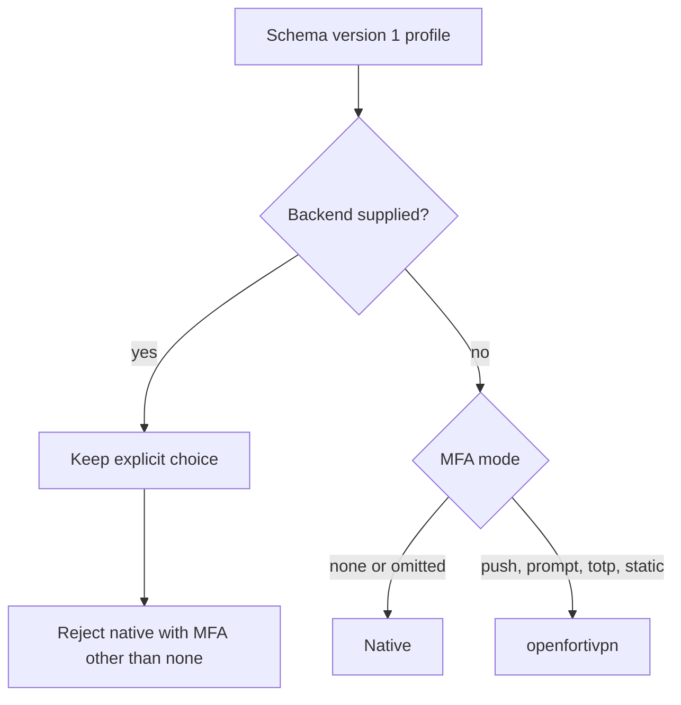
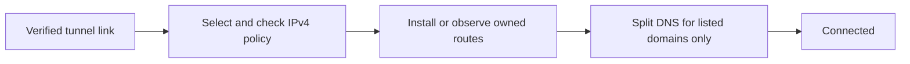

# Profiles

Profiles are secret-free JSON objects in schema version 1. The CLI validates
local drafts; the helper independently validates and stores them through the
control socket. All authorized `fortix` group members can manage every profile.
There is no per-user owner field and no administrator approval for each edit.

## Storage and validation

Use `fortix profile validate <file>` before `fortix profile add <file>`.
`profile add` creates or replaces a stored inactive profile; an active profile
cannot be replaced or deleted. Local edits do not affect the stored copy until
added again. `profile show <id>` prints that copy and `profile rm <id>` (or `profile remove <id>`) removes
an inactive copy.

Stored profiles are `root:fortix 0640` files in a `root:fortix 0750` directory under:

- macOS: `/Library/Application Support/fortix/profiles/`
- Linux: `/etc/fortix/profiles/`

The helper refuses symlinks, unsafe ownership/modes, traversal, and non-regular
files. Drafts can be kept wherever the user chooses, but should not contain
secrets. Stored usernames and gateway names are configuration, not encrypted
personal data, but stored copies are readable only by root and fortix members.

The decoder accepts one object of at most 64 KiB, with no trailing JSON,
unknown fields, duplicate keys (including nested keys), or null values.
Passwords, second-factor seeds, arbitrary openfortivpn options, and executable
paths have no schema fields and are rejected.

## Full field reference

| Field | Type and constraints | Default |
| --- | --- | --- |
| `schema_version` | Integer, exactly `1` | Required |
| `id` | Lowercase ASCII letter/digit first, then letters/digits/hyphens, 1..63 characters | Required |
| `name` | Valid UTF-8, 1..64 characters, no control characters | Required |
| `backend` | `native` or `openfortivpn`; explicit native requires `mfa.mode: none` | `native` for MFA `none`, otherwise `openfortivpn` |
| `gateway.host` | DNS hostname or unscoped IP literal; no URL scheme, path, or port suffix | Required |
| `gateway.port` | Integer, 1..65535 | `443` when omitted or zero |
| `realm` | At most 64 ASCII letters, digits, dots, underscores, or hyphens | Empty |
| `username` | UTF-8, 1..256 characters, no controls or whitespace at either end | Required |
| `trusted_cert` | Read-only through the helper; SHA-256 digest, 64 hexadecimal characters; case and colon separators normalize | Empty |
| `mfa.mode` | `none`, `push`, `prompt`, `totp`, or `static` | `none` |
| `mfa.digits` | `6` or `8`, allowed only for `totp` | `6` for `totp` |
| `mfa.period` | Integer seconds, 15..120, allowed only for `totp` | `30` for `totp` |
| `mfa.algorithm` | `SHA1`, `SHA256`, or `SHA512`, allowed only for `totp` | `SHA1` for `totp` |
| `routes.mode` | `gateway`, `custom`, or `full` | `gateway` |
| `routes.include` | Nonempty list of canonical, masked IPv4 CIDRs; /8..32; no duplicate/overlapping entries; allowed only for `custom` | Absent |
| `routes.preserve_lan` | Boolean; explicit false is preserved | `true` |
| `dns.mode` | `none` or `split` | `none` |
| `dns.domains` | 1..32 lowercase DNS names with at least two labels, without wildcard/trailing dot or duplicates; allowed only for `split` | Absent |

Hostnames use ASCII DNS labels, at most 63 characters per label and 253 total,
with no leading/trailing label hyphen. IP address literals must not contain a
zone identifier. Do not include `https://` in a gateway host.

Objects whose fields all have defaults can be omitted. `gateway` must still
supply a host. `routes.include` and `dns.domains` must be **absent**, not empty
arrays, when their modes do not allow them. Non-TOTP modes forbid all TOTP
parameters, including explicit zero values. `routes.preserve_lan: null` is
invalid, not an instruction to use the default.

### Backend selection and MFA behavior



Omitted `backend` resolves from MFA after defaults are applied. Explicit backend
values in stored profiles are preserved, including an existing password-only
`openfortivpn` choice. Schema version stays `1`; changing the default does not
migrate explicit values. Edit an inactive profile or use the app's backend
selector to change it. **Automatic** in the editor represents an omitted backend.
Imports omit the backend to leave this decision to the final MFA configuration.

Native supports only password authentication with `mfa.mode: none`, without
openfortivpn or pppd. An unexpected second-factor challenge fails with an
actionable instruction to use openfortivpn; it never prompts for native 2FA or
silently resends credentials through a different backend. A missing optional
executable also fails without fallback.

For openfortivpn, `none` is appropriate for password-only accounts, though an
unexpected code challenge still gets a hidden prompt. `push` allows its
FortiToken push path; other modes pass `--no-ftm-push`. The UI does not claim
that a push was delivered. macOS requires an explicitly installed root-owned
openfortivpn copy for these modes; Linux uses trusted system binaries.

`prompt`, `totp`, and `static` currently all use hidden code input when a code
challenge arrives. TOTP generation and dedicated second-secret/seed keyring
management are not wired into the clients, even though their schema parameters
are validated. Do not put these secrets in JSON. Saving a password is governed
by user preferences or CLI `--save`, not by a profile field.

### Routes and DNS behavior



| Route mode | Native | openfortivpn |
| --- | --- | --- |
| `custom` | Install only `routes.include`, ignoring pushed route intent | Disable upstream route installation; helper installs only included prefixes |
| `gateway` | Install pushed split routes; reject `/0` and either `/1` | Observe upstream-installed routes and reject defaults on the tunnel link |
| `full` | Use pushed routes; if splits are absent or defaults are pushed, normalize to two owned `/1` routes | Permit upstream default/split-default handling; no helper-synthesized native fallback |

Native full-mode fallback installs `0.0.0.0/1` and `128.0.0.0/1` without replacing
the physical default. A host-route exception keeps the actual TLS gateway IPv4
address reachable through its physical next hop. Full fallback fails safely
when that IPv4 exception cannot be established. With only non-default split
routes present, native `full` keeps those routes; the mode alone does not force
all IPv4 traffic through the VPN. Only one full tunnel can be reserved at once.

Native registers its link identity before configuring it and reserves selected
routes before route mutation. Duplicate local addresses, overlapping reservations,
connected subnets, and competing live routes are refused. Openfortivpn may add
pushed routes before inspection; typed failures from both stdout and stderr,
including an existing-route clash, prevent reporting that attempt as connected.
Do not assume these checks eliminate every transient change or a race with
another network manager.

`preserve_lan` is accepted and defaults to true but does not add LAN bypass
routes. More-specific physical routes can remain effective under the native
`/1` fallback; this is route precedence, not an implemented guarantee from the
field. Custom routing is the most predictable option for local-network access.

With `split`, the helper uses negotiated IPv4 DNS servers, with XML fallback
for native if IPCP does not supply DNS. It configures only `dns.domains`:
gateway-advertised suffixes are metadata and do not automatically expand policy.
On macOS it owns `/etc/resolver/<domain>` files, refusing foreign files or a
domain already owned by another profile. Linux uses per-link `resolvectl dns`
and routing-only domains (`~domain`), not a global `~.` domain. Linux
requires working systemd-resolved and resolvectl; there is no resolvconf fallback.

Openfortivpn and pppd DNS writers are disabled in all modes. `none` leaves DNS
unmanaged. A full IPv4 route does not make split DNS global, and neither mode
prevents other applications or the OS from resolving names elsewhere. IPv6 VPN
routing and universal leak prevention are not supported.

## Examples

All example hosts/domains are reserved placeholders and private CIDRs are
illustrative, not live configuration. Replace them and `YOUR_VPN_USERNAME` with
administrator-provided settings. Never put passwords, seeds, or codes in JSON.

### Native password-only custom routing and split DNS

```json
{
  "schema_version": 1,
  "id": "work",
  "name": "Work",
  "backend": "native",
  "gateway": { "host": "vpn.example.com", "port": 10443 },
  "realm": "staff",
  "username": "YOUR_VPN_USERNAME",
  "mfa": { "mode": "none" },
  "routes": {
    "mode": "custom",
    "include": ["10.20.0.0/16"],
    "preserve_lan": true
  },
  "dns": { "mode": "split", "domains": ["corp.example.com"] }
}
```

### Minimal gateway-routing profile (defaults to native)

```json
{
  "schema_version": 1,
  "id": "work",
  "name": "Work",
  "gateway": { "host": "vpn.example.com" },
  "username": "YOUR_VPN_USERNAME"
}
```

### Push approval and explicit full-tunnel intent

```json
{
  "schema_version": 1,
  "id": "work",
  "name": "Work",
  "backend": "openfortivpn",
  "gateway": { "host": "vpn.example.com", "port": 443 },
  "username": "YOUR_VPN_USERNAME",
  "mfa": { "mode": "push" },
  "routes": { "mode": "full", "preserve_lan": true },
  "dns": { "mode": "none" }
}
```

## Certificate trust and import

Trust accepts **either** a valid system certificate chain plus hostname **or**
a matching SHA-256 digest of the leaf certificate's DER bytes. The pin is not a
public-key hash and is not an extra restriction on otherwise valid PKI. A
matching pin can accept a certificate whose hostname, expiry, or chain fails
normal validation, so independently verifying the digest is essential. Native
applies the same TLS 1.2-or-later verifier to login, config/tunnel, and logout;
credentials are not sent before the login connection is verified.

If neither trust path succeeds, fortix displays the captured digest, subject,
and issuer. Verify those with the VPN administrator before confirming.
`fortix trust <id>` or the desktop confirmation sends the captured digest back
to the helper. Only the initiating UID or root may confirm it. The helper accepts
only its last rejected digest for that profile, stores `trusted_cert`, and starts
a new attempt. A changed certificate that still fails PKI requires confirmation
of its new digest; an otherwise valid certificate needs no pin confirmation.

`profile add` preserves the helper-owned pin only when the gateway host and port
are unchanged and ignores submitted `trusted_cert`; it cannot set or replace
a pin. Changing the endpoint, or removing and re-adding a profile, clears it.

### Shared profile commands


`fortix profile export <id>... [-o FILE] [--force]` exports one or more stored
profiles in order. The versioned shared document contains neither usernames nor
passwords. Without `-o`, JSON goes to stdout. Output files are created with mode
`0644`, subject to the process umask; an existing file is refused unless `--force`
is explicit.

`fortix profile import FILE [--username NAME] [--id ID] [--name NAME] [--merge ID] [--yes]`
reads shared JSON, or stdin when FILE is `-`. Multi-profile documents import every
entry. `--id`, `--name`, and `--merge` are limited to single-profile documents.
New profiles use the shared ID and name unless overridden. On a terminal, missing
required fields are prompted; noninteractive imports list omissions and fail.
The username is supplied locally through `--username` or a prompt. Stdin documents
cannot also supply interactive completion or consent.

An existing ID is refused without `--merge ID`. Merge overlays supplied fields
onto the selected stored profile, keeps that profile's ID and username, and
replaces supplied route and DNS lists rather than appending. A merge that changes
the gateway host or port is shown and needs confirmation at the default-No
terminal prompt, or `--yes` noninteractively, because the next connection sends
the password to the new gateway. All entries are
validated and checked for existing IDs before the first save. Helper write failures
stop further saves; a multi-profile import is not an atomic transaction.

A nonempty shared `trusted_cert` is printed as an unverified fingerprint and is
not saved: shared import uses the same helper save operation as `profile add`,
so submitted pins are ignored and cannot establish certificate trust. Whoever
made the file chose that value, so a match proves nothing on its own. If the
gateway certificate is rejected, confirm its fingerprint with the administrator
over a separate channel, then run `fortix trust <id>`, the only trust path. Import never prompts for or
stores a password. After importing, `fortix up <id>` asks for it when needed,
and `fortix up <id> --save` can save it to the keychain after a successful connection.

`fortix import forticlient [--plist path]` previews non-secret drafts read from
FortiClient's macOS plist. `--apply` stores the displayed drafts. Import does
not decrypt or copy saved FortiClient passwords and never modifies its source.
Review MFA, route mode, and split domains before applying a draft; import cannot
infer every gateway authentication requirement. It imports no certificate trust.
