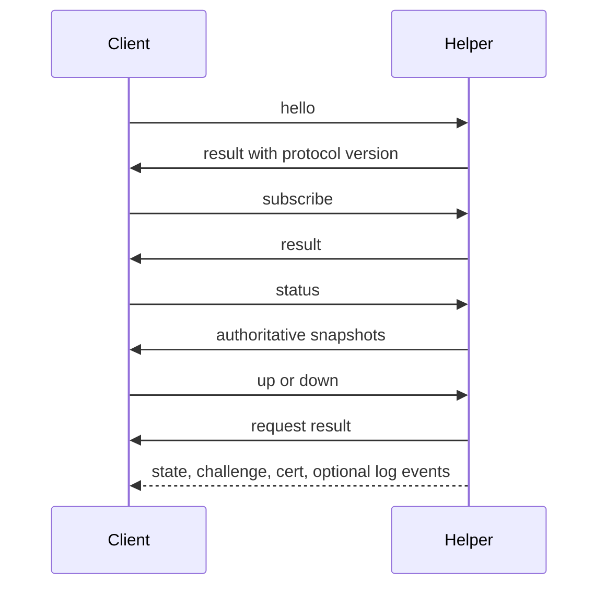
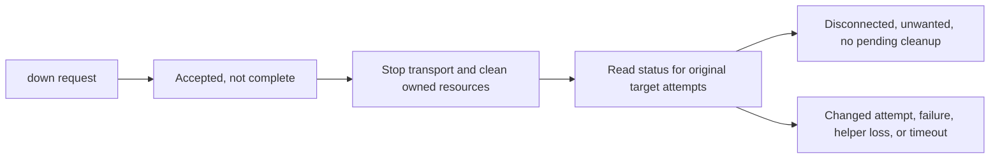
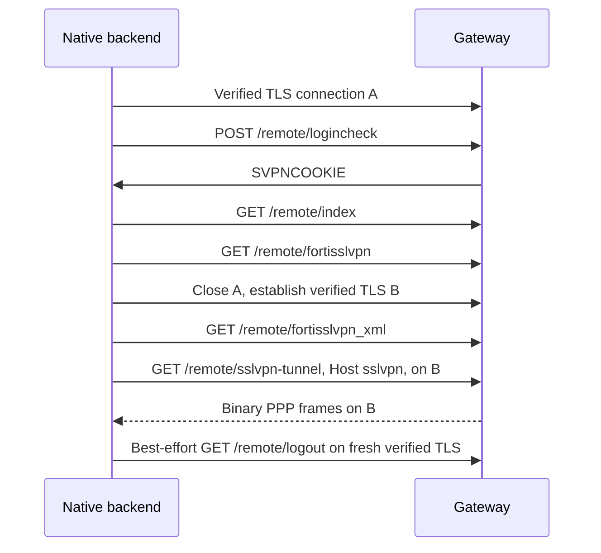

# Protocols

fortix has two separate protocols: the local control socket used by desktop
clients, and the remote TLS/PPP protocol used by the native backend. Selecting
openfortivpn delegates the remote protocol to that separate executable; both
backends expose the same helper-owned lifecycle to clients.

## Local control socket

The socket is Unix-domain, not a TCP listener. It is `/var/run/fortix/fortix.sock`
on macOS or `/run/fortix/fortix.sock` on Linux, owned `root:fortix 0660` and
protected by kernel peer credentials. Root or fortix group membership authorizes
machine-wide profile management. See [security](security.md) for the boundary.

Records are newline-delimited UTF-8 JSON objects, at most 64 KiB including the
newline. Incomplete, oversized, duplicate-key, unknown-field, null, and malformed
records are rejected. Request `id` is a nonempty correlation string, at most
128 bytes. Results have `type: result`, that `id`, and `ok`; failures carry
`error.code` and `error.message`, while success may carry operation-specific
`data`. Results and asynchronous events share one ordered stream, so clients
must continuously read and correlate replies rather than treating the next
record as their result.

`hello` identifies the client binary version; the helper reports protocol version
`1`, which is separate from profile `schema_version: 1`. `subscribe` requests
state notifications and optionally `logs: true`. Follow subscription with a
fresh `status` snapshot so missed history is not mistaken for current state.

| Operation | Arguments beyond `id` and `op` |
| --- | --- |
| `hello` | Optional client `version` |
| `subscribe` | Optional `logs` boolean |
| `profile.list`, `status` | None |
| `profile.get`, `profile.delete`, `up` | `profile` ID |
| `profile.put` | Inline `profile_json` object |
| `down` | `profile`, or `all: true`, never both |
| `answer` | `challenge_id` and `secret` |
| `cancel` | `challenge_id` |
| `trust` | `profile` and helper-captured `digest` |
| `logs` | `profile` and optional `lines` (up to 500) |

Secrets belong only in live `answer` requests, never profile JSON, diagnostic
examples, or logs. Challenge replies are attempt-bound and authorized to the
initiating UID or root. All clients use the shared secret-record size limit,
including native sessions. A submitted pin cannot be set through `profile.put`.

Events use `type` equal to `state`, `challenge`, `cert`, or `log`, plus `profile`
and `attempt`. State adds `state`, `detail`, `wanted`, `initiated`, and
`cleanup_pending`, and may include an error `code`. Challenge adds
`challenge_id`, `kind`, and `prompt`; cert adds `digest`, `subject`, and `issuer`;
log adds a redacted `line`. Old attempts cannot answer a current challenge.
Reconnecting clients discard stale state, resubscribe, and refresh snapshots;
they must not replay `up`, trust, or secret-bearing mutations automatically.

### Disconnect completion

The helper's `down` operation remains asynchronous. CLI `down`, the Go client's
`WaitStopped`, and the macOS client's `down` verify status rather than treating
an acknowledgement or teardown log as proof. Subscribe before stopping and
capture every target's attempt. Completion requires all selected targets to
remain in that generation, with `state: disconnected`, `wanted: false`, and
`cleanup_pending: false`. Cleanup failures, missing targets, competing starts,
helper loss, and deadline expiry are errors. The clients cap the wait at
30 seconds; CLI `--all` uses one overall budget, not one budget per profile.
A timeout does not prove that the host is clean or cancel already accepted work.

## Native gateway exchange

Native supports password-only gateways, with optional realm, not MFA or SAML.
The login form supplies `username`, `credential`, `realm`, and `ajax=1` over
HTTP/1.1 inside verified TLS. An accepted login must return a bounded, nonempty
`SVPNCOOKIE`; no cookie is written to configuration or logs. Unexpected MFA
returns an actionable failure to select openfortivpn, never an automatic
credential resend through another backend. Redirects are not followed.

TLS requires at least 1.2. Every connection accepts either valid system PKI and
hostname or the explicitly trusted leaf DER SHA-256 digest. The login connection
is checked before credentials are sent. The pin is an alternative trust path,
not an additional restriction; see [certificate trust](profiles.md#certificate-trust-and-import).

The XML response contains bounded fallback address/DNS metadata and IPv4 split
routes. IPCP supplies the authoritative local IPv4 address and negotiated DNS;
XML DNS is fallback only. Advertised suffixes never automatically become managed
split domains. HTTP headers are capped at 32 KiB, login bodies at 16 KiB, and
XML bodies at 256 KiB, with additional nesting and entry limits. Gateway body
text is not exposed in authentication errors.

### Tunnel framing and PPP

| Frame component | Encoding |
| --- | --- |
| Total length | Big-endian unsigned 16-bit, payload length plus 6 |
| Marker | Big-endian `0x5050` |
| Payload length | Big-endian unsigned 16-bit |
| Payload | PPP protocol field and packet, without HDLC framing |

The frame decoder rejects empty payloads, bad markers, mismatched lengths, and
truncation. The maximum representable payload is 65,529 bytes; PPP enforces its
smaller negotiated MRU. The default offered MRU is 1,354 bytes.

PPP implements LCP (`0xc021`), IPCP (`0x8021`), and IPv4 (`0x0021`), using bounded
configure retries, echo keepalives, and termination. LCP negotiates MRU and magic
number and rejects protocol/address-control compression, PPP authentication,
and unsupported compression options. IPCP negotiates address option 3 and DNS
options 129/131. It does not implement PAP, CHAP, or IPv6 tunnel traffic.

Native allocates an owned `utun` device on macOS or a Linux TUN device through
`/dev/net/tun` with `IFF_TUN | IFF_NO_PI`. No pppd is launched. The helper records
link identity, configures the IPv4 address and MTU, checks/reserves routes, and
applies split DNS before enabling packet forwarding. Non-IPv4 packets are not
forwarded. See [routing policy](profiles.md#routes-and-dns-behavior).

Stopping cancels forwarding, attempts bounded PPP termination and remote logout,
and performs owned-resource cleanup before reporting clean disconnection.
Remote logout is best effort: local cleanup success is not proof that the
remote gateway invalidated its session. Native MFA, SAML, client certificates,
DTLS, IPv6, and compression remain unsupported.
