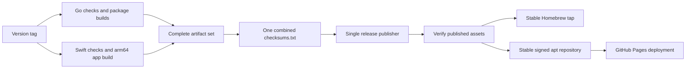

# Releases and verification

## Artifact set



The [release workflow](../.github/workflows/release.yml) builds without publishing
in its Go and macOS jobs. A dependent publisher validates the combined artifact
set, creates a sorted SHA-256 `checksums.txt`, and publishes all assets together.
One platform job succeeding is not a complete release. The publisher downloads
and verifies the published assets before either package-channel job starts. Each
channel downloads and verifies them again before using the final manifest.

Stable tags then update `avhn/homebrew-tap` and the signed apt repository at
<https://avhn.github.io/fortix/apt>. Tags containing `-` skip both channel jobs.
These jobs never modify or delete the GitHub release, even if channel publishing
fails. Channel updates are serialized independently to avoid concurrent pushes.

| Asset | Platforms and contents |
| --- | --- |
| `fortix_*_linux_*.tar.gz` | amd64/arm64: CLI, helper, Linux tray, license, notices, README |
| `fortix_*_darwin_*.tar.gz` | amd64/arm64: CLI and helper, license, notices, README; no Swift app or Go tray |
| `fortix_*_linux_*.deb` | amd64/arm64: systemd package, CLI/helper/tray, license and notices |
| `fortix_*_darwin_arm64.dmg` | macOS 13+ arm64 app with an Applications link |
| `fortix_*_darwin_arm64.app.zip` | Same arm64 Fortix.app bundle in a zip |
| `checksums.txt` | All eight downloadable assets above |

The app bundles the CLI, helper, and pinentry under `Contents/Resources/libexec`,
plus `LICENSE` and `THIRD_PARTY_NOTICES.txt`. It does not bundle openfortivpn,
pppd, or their optional dependencies. The Debian package depends on `iproute2`
and recommends `openfortivpn` and `ppp`; native tunnels need neither recommendation.
The Linux split-DNS service and desktop prompt/notification tools are separate
host prerequisites, not mandatory package dependencies.

GPL-3.0-or-later remains the fortix license. Third-party notices describe linked
module versions and licenses; they do not change fortix's license. Optional
openfortivpn is a separate executable. Distributing any bundled copy of that
executable or its libraries requires their notices and corresponding source
obligations as well.

## Package-channel publishing

The `homebrew` job renders `Formula/fortix.rb` and `Casks/fortix.rb` from templates
using SHA-256 values in the combined release manifest. The formula selects the
matching darwin/linux amd64/arm64 archive and installs the CLI and helper. There
is no separate pinentry executable in these archives: privileged helper
installation creates its link. The cask uses the arm64 DMG, requires macOS 13+,
and explains the app's lack of notarization. Its `zap` removes only the user's
preferences plist. Helper removal remains an explicit app uninstall action;
cask removal does not delete machine state or VPN profiles.

The `apt` job fetches `gh-pages`, retains all existing `apt/pool/main/*.deb`
versions, adds the new packages, and regenerates `stable/main` indexes for amd64
and arm64 with `apt-ftparchive`. It rejects replacement of an existing package
with different bytes. Signing uses an ephemeral, private `GNUPGHOME` and verifies
the imported primary-key fingerprint before signing. It publishes `Release`,
clearsigned `InRelease`, detached `Release.gpg`, and the public key in both binary
and armored formats. The passphrase is supplied through a private file
descriptor, not a command-line argument, and shell tracing is disabled for key
handling. The key directory and agent are cleaned up after the job.

The job pushes only `apt/` and `.nojekyll` on `gh-pages`, preserving other Pages
content. It then uploads that retained site and explicitly deploys it with Pages
actions: a push made with `GITHUB_TOKEN` alone does not trigger a Pages build.
The binary `.gpg` export is already dearmored and is apt's `signed-by` keyring.
The `.asc` export is provided for inspection and other OpenPGP tools.

### Required setup and secrets

| Secret | Use |
| --- | --- |
| `HOMEBREW_TAP_DEPLOY_KEY` | SSH private deploy key with write access to `avhn/homebrew-tap` |
| `APT_SIGNING_KEY` | Armored private apt signing key, including any required signing subkey |
| `APT_SIGNING_PASSPHRASE` | Passphrase for the encrypted apt signing key |
| `GITHUB_TOKEN` | Automatically supplied token for release assets and the `gh-pages` push; no personal token required |

The apt primary-key fingerprint must be exactly
`7F1D1CA8B09790EAC0FA70DA1A52C72D8C1F6F06`. A missing, additional, or different
primary signing key fails the job. Never paste private keys or passphrases into
workflow files, command-line arguments, or logs.

In repository **Settings > Pages**, select **GitHub Actions** as the publishing
source. Allow release tags in the `github-pages` environment's deployment
protection rules. Keep the default Pages URL so the repository remains at
`https://avhn.github.io/fortix/apt`. The `apt` job alone gains Pages deployment
permissions (`pages: write`, `id-token: write`) and its own `contents: write`;
other build and tap jobs retain read-only repository access. The release
publisher separately needs `contents: write` for release creation. The tap uses
only its repository-specific deploy key for writes.

### Homebrew installation

```sh
# CLI and helper, on a supported macOS or Linux architecture
brew install avhn/tap/fortix
sudo fortix-helper install

# Optional, only for second-factor gateways
brew install openfortivpn

# Menu-bar app, on arm64 macOS 13 or later
brew install --cask avhn/tap/fortix
```

The formula requires privileged helper installation once. The app manages its
own helper installation. Only clear the installed app's quarantine after
verifying the download and deciding to trust this unnotarized release:

```sh
xattr -dr com.apple.quarantine /Applications/Fortix.app
```

This is a per-app exception, not a global Gatekeeper bypass.

### Apt installation and signature verification

On Debian/Ubuntu amd64 or arm64, install the download and key-inspection tools:

```sh
sudo apt-get update
sudo apt-get install --yes ca-certificates curl gnupg
```

Download the binary public key into a fresh directory, check its fingerprint,
and scope trust to this repository with `signed-by`. The subshell stops on any
failure before installing the key or adding the repository:

```sh
(
  set -eu
  KEYDIR="$(mktemp -d)"
  trap 'rm -rf "$KEYDIR"' EXIT
  curl --fail --silent --show-error --location \
    https://avhn.github.io/fortix/apt/fortix-archive-keyring.gpg \
    --output "$KEYDIR/fortix-archive-keyring.gpg"
  FINGERPRINT="$(gpg --batch --with-colons --show-keys "$KEYDIR/fortix-archive-keyring.gpg" \
    | awk -F: '$1 == "fpr" { print $10; exit }')"
  test "$FINGERPRINT" = 7F1D1CA8B09790EAC0FA70DA1A52C72D8C1F6F06
  sudo install -d -m 0755 /etc/apt/keyrings
  sudo install -m 0644 "$KEYDIR/fortix-archive-keyring.gpg" /etc/apt/keyrings/fortix-archive-keyring.gpg
  printf '%s\n' 'deb [arch=amd64,arm64 signed-by=/etc/apt/keyrings/fortix-archive-keyring.gpg] https://avhn.github.io/fortix/apt stable main' \
    | sudo tee /etc/apt/sources.list.d/fortix.list >/dev/null
  sudo apt-get update
  sudo apt-get install --yes fortix
)
```

`apt-get update` verifies `InRelease` and the index hashes with the scoped key;
package downloads are checked against those authenticated indexes. Do not use
`trusted=yes`, `--allow-unauthenticated`, or a globally trusted `apt-key` import
to work around a failure. Stop on a fingerprint or signature mismatch.

For independent signature inspection, use another fresh directory:

```sh
VERIFYDIR="$(mktemp -d)"
for FILE in InRelease Release Release.gpg; do
  curl --fail --silent --show-error --location \
    "https://avhn.github.io/fortix/apt/dists/stable/$FILE" --output "$VERIFYDIR/$FILE"
done
gpgv --keyring /etc/apt/keyrings/fortix-archive-keyring.gpg "$VERIFYDIR/InRelease"
gpgv --keyring /etc/apt/keyrings/fortix-archive-keyring.gpg "$VERIFYDIR/Release.gpg" "$VERIFYDIR/Release"
```

Both verification commands must report a good signature and exit zero. Remove
the temporary directory afterwards. Checking a signature authenticates the
Release metadata; apt additionally checks its referenced indexes and packages.

### Recovery after a channel publishing failure

1. Inspect the failed `homebrew` or `apt` job and correct its cause: missing
   secret, expired or mismatched signing key, deploy-key access, GitHub Pages
   setup, deployment protection, or a temporary network failure.
2. In the original tagged release's Actions run, rerun the failed job (or choose
   **Re-run failed jobs**). Do not rerun all jobs or recreate the release just to
   repair a channel. The already published assets and manifest remain intact.
3. The tap renderer regenerates identical files and skips an unchanged commit.
   The apt job fetches the current `gh-pages`, reuses identical debs, retains old
   versions, regenerates signatures, and deploys again. A failure after the
   branch push but before Pages deployment is recovered by the same rerun.
4. Confirm both channel jobs are green, inspect the tap's version/URLs/hashes,
   and run the apt signature verification above before announcing availability.

If release-asset verification fails, investigate the tagged assets first. A
channel rerun must never bypass verification, replace a retained deb, force-push
history, or delete a GitHub release. Previously published channel contents stay
available until a successful update.

## Verify a download

Download the selected asset and `checksums.txt` from the **same tagged release**
on [GitHub Releases](https://github.com/avhn/fortix/releases). Put the downloads
in a fresh directory, not inside a source checkout or an existing extracted
archive. Verify before opening the DMG, extracting an archive, or granting an
installer administrator privileges.

Set `ASSET` below to the exact basename of the file you downloaded, replacing
`YOUR_DOWNLOADED_ASSET_FILENAME`. Extract only that entry, because checking the
entire manifest would fail on other assets you did not download:

```sh
ASSET='YOUR_DOWNLOADED_ASSET_FILENAME'
awk -v asset="$ASSET" '$2 == asset { print; count++ } END { if (count != 1) exit 1 }' \
  checksums.txt > selected-checksum.txt
```

If this command fails, stop. Do not use an empty or ambiguous checksum entry.
Then verify the selected file with the platform's SHA-256 checker:

```sh
# macOS
shasum -a 256 -c selected-checksum.txt
```

```sh
# Debian/Ubuntu
sha256sum -c selected-checksum.txt
```

Expect the selected filename followed by `OK` and exit status zero. A missing
entry, missing file, or mismatch is a failure: do not install it. Obtain a fresh
copy from the intended release and investigate persistent disagreement.

A checksum detects damage or substitution relative to the downloaded manifest.
It does not authenticate a publisher if the asset and manifest source are both
compromised. The manifest is not independently signed. Ad hoc app signatures
verify internal code integrity, not Developer ID identity or notarization.
Review provenance and the release source before trusting privileged inputs.
See [installation](../README.md#installation) for Gatekeeper's per-app **Open
Anyway** flow; do not globally disable Gatekeeper.

## Source build and package checks

Use the Go toolchain declared in `go.mod` and an arm64 macOS host with the Swift
and system packaging tools needed by the app scripts. These checks use fixtures,
not privileged installation or host network changes. From the repository root:

```sh
GOMAXPROCS=2 GOFLAGS=-p=2 make check
GOMAXPROCS=2 GOFLAGS=-p=2 make cross-build
GOMAXPROCS=2 GOFLAGS=-p=2 go build -o bin/fortix-swift-test ./cmd/fortix
FORTIX_TEST_CLI="$PWD/bin/fortix-swift-test" swift test --package-path macos --jobs 2
swift build --package-path macos --jobs 2
```

`make check` runs format checks, lint, race tests, packaging fixtures, and
third-party-notice consistency. `cross-build` serially checks darwin/linux
amd64/arm64, excluding the cgo-only legacy macOS tray from cross-compilation.
The Swift test CLI enables real CLI import-preview fixtures; without it that
integration test is skipped, so inspect the actual test output.
These gates do not prove live-gateway interoperability or clean-machine setup.

For a local release package, supply an explicit version and choose output paths
that do not already exist. The scripts refuse to replace existing bundles or
images. This example builds v0.2.0; adjust the version for the release you intend:

```sh
scripts/build-macos-app.sh v0.2.0 dist/Fortix-local.app
scripts/build-dmg.sh dist/Fortix-local.app dist/fortix-local.dmg
scripts/verify-macos-package.sh dist/Fortix-local.app dist/fortix-local.dmg
```

Packaging uses bounded Go compilation and Swift `--jobs 2`. Bundle verification
checks executable layout and signatures, and inspects a read-only image without
installing the helper. Before distributing a release, verify real password and
MFA gateways separately, full/custom/gateway routing, split DNS, clean shutdown,
recovery, group enrollment, and installation on clean supported hosts. Do not
infer those outcomes from fixture-only checks.

## Limitations

- The macOS app and DMG are arm64 only; Intel macOS has CLI archives.
- No Developer ID signing, notarization, automatic updates, or Windows package.
- No openfortivpn bundled with the app. MFA requires explicitly installed optional
  support and a compatible gateway; native never handles second factors.
- No native SAML/SSO, client-certificate authentication, DTLS, PAP/CHAP,
  compression, or IPv6 tunnel routing. There is no Linux profile-editor window;
  the Linux tray and CLI remain available.
- No kill switch or universal DNS/leak-prevention guarantee. `preserve_lan` does
  not implement bypass routes, and full route mode does not turn split DNS into
  global DNS. See [profiles](profiles.md) and [security](security.md).
