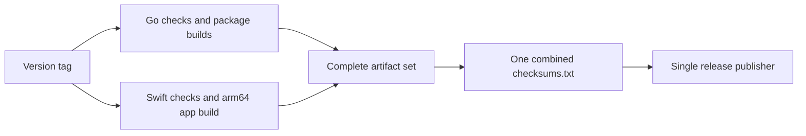

# Releases and verification

## Artifact set



The [release workflow](../.github/workflows/release.yml) builds without publishing
in its Go and macOS jobs. A dependent publisher validates the combined artifact
set, creates a sorted SHA-256 `checksums.txt`, and publishes all assets together.
One platform job succeeding is not a complete release.

| Asset | Platforms and contents |
| --- | --- |
| `fortix_*_linux_*.tar.gz` | amd64/arm64: CLI, helper, Linux tray, license, notices, README |
| `fortix_*_darwin_*.tar.gz` | amd64/arm64: CLI and helper, license, notices, README; no Swift app or Go tray |
| `fortix_*_linux_*.deb` | amd64/arm64: systemd package, CLI/helper/tray, license and notices |
| `fortix_*_darwin_arm64.dmg` | macOS 13+ arm64 app with an Applications link |
| `fortix_*_darwin_arm64.app.zip` | Same arm64 Fortix.app bundle in a zip |
| `checksums.txt` | All eight downloadable assets above |

The app bundles the CLI, helper, and pinentry under `Contents/Resources/libexec`,
plus `LICENSE` and `THIRD_PARTY_NOTICES.txt`. It does not bundle openfortivpn,
pppd, or their optional dependencies. The Debian package depends on `iproute2`
and recommends `openfortivpn` and `ppp`; native tunnels need neither recommendation.
The Linux split-DNS service and desktop prompt/notification tools are separate
host prerequisites, not mandatory package dependencies.

GPL-3.0-or-later remains the fortix license. Third-party notices describe linked
module versions and licenses; they do not change fortix's license. Optional
openfortivpn is a separate executable. Distributing any bundled copy of that
executable or its libraries requires their notices and corresponding source
obligations as well.

## Verify a download

Download the selected asset and `checksums.txt` from the **same tagged release**
on [GitHub Releases](https://github.com/avhn/fortix/releases). Put the downloads
in a fresh directory, not inside a source checkout or an existing extracted
archive. Verify before opening the DMG, extracting an archive, or granting an
installer administrator privileges.

Set `ASSET` below to the exact basename of the file you downloaded, replacing
`YOUR_DOWNLOADED_ASSET_FILENAME`. Extract only that entry, because checking the
entire manifest would fail on other assets you did not download:

```sh
ASSET='YOUR_DOWNLOADED_ASSET_FILENAME'
awk -v asset="$ASSET" '$2 == asset { print; count++ } END { if (count != 1) exit 1 }' \
  checksums.txt > selected-checksum.txt
```

If this command fails, stop. Do not use an empty or ambiguous checksum entry.
Then verify the selected file with the platform's SHA-256 checker:

```sh
# macOS
shasum -a 256 -c selected-checksum.txt
```

```sh
# Debian/Ubuntu
sha256sum -c selected-checksum.txt
```

Expect the selected filename followed by `OK` and exit status zero. A missing
entry, missing file, or mismatch is a failure: do not install it. Obtain a fresh
copy from the intended release and investigate persistent disagreement.

A checksum detects damage or substitution relative to the downloaded manifest.
It does not authenticate a publisher if the asset and manifest source are both
compromised. The manifest is not independently signed. Ad hoc app signatures
verify internal code integrity, not Developer ID identity or notarization.
Review provenance and the release source before trusting privileged inputs.
See [installation](../README.md#installation) for Gatekeeper's per-app **Open
Anyway** flow; do not globally disable Gatekeeper.

## Source build and package checks

Use the Go toolchain declared in `go.mod` and an arm64 macOS host with the Swift
and system packaging tools needed by the app scripts. These checks use fixtures,
not privileged installation or host network changes. From the repository root:

```sh
GOMAXPROCS=2 GOFLAGS=-p=2 make check
GOMAXPROCS=2 GOFLAGS=-p=2 make cross-build
GOMAXPROCS=2 GOFLAGS=-p=2 go build -o bin/fortix-swift-test ./cmd/fortix
FORTIX_TEST_CLI="$PWD/bin/fortix-swift-test" swift test --package-path macos --jobs 2
swift build --package-path macos --jobs 2
```

`make check` runs format checks, lint, race tests, packaging fixtures, and
third-party-notice consistency. `cross-build` serially checks darwin/linux
amd64/arm64, excluding the cgo-only legacy macOS tray from cross-compilation.
The Swift test CLI enables real CLI import-preview fixtures; without it that
integration test is skipped, so inspect the actual test output.
These gates do not prove live-gateway interoperability or clean-machine setup.

For a local release package, supply an explicit version and choose output paths
that do not already exist. The scripts refuse to replace existing bundles or
images. This example builds v0.2.0; adjust the version for the release you intend:

```sh
scripts/build-macos-app.sh v0.2.0 dist/Fortix-local.app
scripts/build-dmg.sh dist/Fortix-local.app dist/fortix-local.dmg
scripts/verify-macos-package.sh dist/Fortix-local.app dist/fortix-local.dmg
```

Packaging uses bounded Go compilation and Swift `--jobs 2`. Bundle verification
checks executable layout and signatures, and inspects a read-only image without
installing the helper. Before distributing a release, verify real password and
MFA gateways separately, full/custom/gateway routing, split DNS, clean shutdown,
recovery, group enrollment, and installation on clean supported hosts. Do not
infer those outcomes from fixture-only checks.

## Limitations

- The macOS app and DMG are arm64 only; Intel macOS has CLI archives.
- No Developer ID signing, notarization, automatic updates, or Windows package.
- No openfortivpn bundled with the app. MFA requires explicitly installed optional
  support and a compatible gateway; native never handles second factors.
- No native SAML/SSO, client-certificate authentication, DTLS, PAP/CHAP,
  compression, or IPv6 tunnel routing. There is no Linux profile-editor window;
  the Linux tray and CLI remain available.
- No kill switch or universal DNS/leak-prevention guarantee. `preserve_lan` does
  not implement bypass routes, and full route mode does not turn split DNS into
  global DNS. See [profiles](profiles.md) and [security](security.md).
