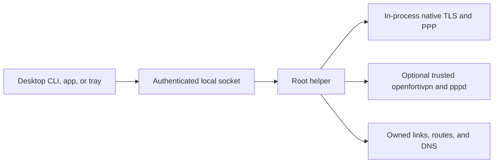
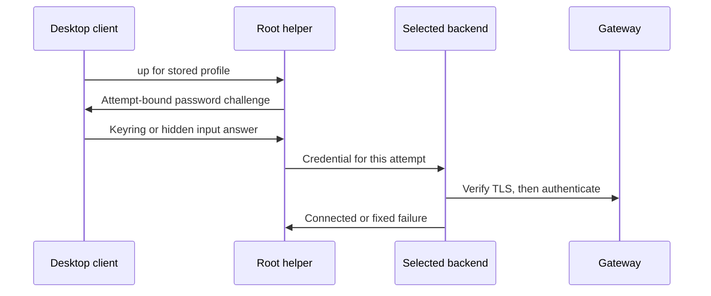

# Security

fortix is an early-development local VPN manager, not a sandbox or a managed
multi-user isolation service. Review its source and test it in an isolated
system before trusting it with production access.

## Privilege boundary

The CLI, macOS app, and Linux tray run as the desktop user. The helper runs as
root, executes native TLS/PPP or the optional openfortivpn process, manages
owned network resources, and records recovery state. Native parser and packet
handling code is therefore privileged and part of the trusted computing base.
Openfortivpn and pppd are also privileged when selected; native uses neither.
The helper never loads desktop UI code or reads the user's keychain.

The control socket is `root:fortix 0660`:

- macOS: `/var/run/fortix/fortix.sock`
- Linux: `/run/fortix/fortix.sock`

Each connection is checked using kernel peer credentials. Root and members
of the `fortix` group are authorized; others are refused. Membership grants
machine-wide management of every profile and tunnel. It is not restricted to
profiles created by that user. Authorized members can change a profile's
username, gateway, routing, and DNS domains, and confirm helper-captured
certificate pins for their own attempts. Membership is a trusted role: it permits
changing system routing and split DNS for the whole machine, affecting every user.
Grant it only to users trusted to manage machine-wide network access.

## What the helper accepts

The local newline-delimited JSON protocol uses bounded 64 KiB records and
correlated results. Typed operations cover version negotiation, subscription,
profile list/get/put/delete, connect/disconnect/status, credential answer/cancel,
certificate trust, and bounded redacted logs. Profile mutation is refused
while active. The helper independently performs strict schema validation;
client validation is not an authorization boundary.

Profiles cannot express raw openfortivpn flags, arbitrary configuration paths,
executables, PPP plugins, shell commands, passwords, or MFA seeds. Unknown
fields, duplicate keys, null values, malformed hostnames/domains/CIDRs, and
unsafe profile IDs fail validation. Stored profiles are `root:fortix 0640` in a `root:fortix 0750` directory, not
readable by non-members. Files are accessed
through trusted directories with symlink, ownership, mode, and file-type checks.

Backend selection is limited to `native` or `openfortivpn`; it cannot select an
arbitrary executable. Native is password-only and rejects second-factor modes
before dialing. Unexpected native MFA fails without silent backend fallback.
Its HTTP headers/bodies, XML, TLS frames, and PPP negotiation are bounded;
redirects and server error bodies are not replayed or exposed as diagnostics.
The native protocol is described in [protocol](protocol.md).

For the optional backend, the helper constructs the openfortivpn argument list itself and executes it
without a shell. Username and realm are supplied through an inherited anonymous
pipe (`-c /dev/fd/3`), never argv or a disk configuration. It uses
a fixed working directory and environment, disabled openfortivpn/PPP DNS
writers, and its own trusted pinentry executable. Password and OTP command-line
flags and code-loading PPP options are never supplied by clients.

Before spawning, the helper checks executable files and their parent
directories for root ownership and unsafe write permissions. On macOS it also
checks loaded dylibs and rejects unsafe library paths. A normal Homebrew tree
is user-writable and must not be executed directly by a root helper. Explicit
installation copies openfortivpn and non-system libraries to a root-owned
location, rewrites Mach-O load paths, and re-signs the copies ad hoc. This does
not prove the original downloaded/build input is trustworthy: administrators
remain responsible for its provenance and checksum verification. Ad hoc signing
checks bundle integrity, not publisher identity; release checksums from the same
download source do not defend against compromise of that source.

The macOS app copies helper inputs from `Contents/Resources/libexec` after one
explicit administrator prompt with a selected desktop `--user`. The runtime
service executes root-owned copies, never a helper left inside a writable app
bundle. No openfortivpn is bundled. Adding the optional backend is a separate
privileged action, not an implicit fallback. The app is not Developer ID signed
or notarized; use Gatekeeper's per-app **Open Anyway** only after verifying
provenance, never a global disablement.

## Secrets and certificate flow

1. A user requests `up` for a stored profile.
2. The helper records the initiating kernel peer UID, retained across automatic
   retries. The optional openfortivpn backend also starts an attempt with a random
   token and trusted pinentry responder; its private relay directory is `0700`.
   Native uses the same challenge broker directly, without a pinentry child.
3. A password/code request is bound to that attempt and routed to the initiating
   client if it is still present, otherwise only to subscribers with the same UID
   or root. Certificate events follow the same rule. Only that UID or root may
   answer, cancel, or trust. Trays ignore prompts for attempts they did not start.
   The first accepted answer wins and expired/obsolete answers are refused.
4. The client reads the OS keyring for passwords, otherwise asks for hidden
   input. Codes use hidden input and are not saved.
5. The secret crosses the local control socket. Native receives it in memory and
   sends it only over verified TLS. Openfortivpn receives it through the
   attempt-bound relay and Assuan pinentry exchange. A password prompt may occur
   before gateway verification; this does not mean credentials have been sent.

Secrets are not placed in files, argv, child environment variables, or log
messages. The keyring service is `fortix`; accounts bind the profile ID to a SHA-256 hash
of the gateway host, port, and username. Legacy ID-only entries are not read:
users re-enter and save the password after upgrading. A changed endpoint or
username cannot reuse a previous saved password.
Unavailable or locked keyrings cause a prompt, never plaintext storage.
`remember_passwords` defaults to true; users can disable it in their private
preferences. CLI `--save` explicitly enables saving. Prompted passwords are
saved only when the matching attempt connects successfully. The macOS app uses
an explicit save checkbox rather than the legacy tray's remember preference.
Its Keychain entries use the same account identity and base64 value encoding as
the Go client, so app and CLI share passwords. A stored password
can still be used when remembering newly prompted passwords is disabled;
remove it with `fortix password clear <id>` or the tray profile's **Forget saved
password** entry if that is not desired.

Secrets necessarily exist in client and helper memory, and in pinentry and
openfortivpn memory when that backend is used,
and traverse local sockets in plaintext protected by OS access controls.
Go strings cannot guarantee cryptographic memory erasure. A process running
as the desktop user may access that user's keychain subject to OS policy;
root can inspect process memory and intercept credentials. fortix does not
protect against a compromised desktop account or root.

Gateway trust preserves the upstream **OR** semantics: a valid system chain
and hostname, **or** an exact SHA-256 pin over the leaf certificate's DER bytes.
It is not a public-key pin or strict pinning layered on top of PKI. A valid PKI
certificate remains accepted even if the saved pin differs. Conversely, a
matching pin can accept invalid PKI, including expiry or hostname failure.
Native requires TLS 1.2 or later and applies the identical verifier on every
connection, including config/tunnel and fresh-connection logout. Trust rejection
precedes transmission of credentials on that connection.

When both trust paths fail, the rejected certificate triggers explicit
confirmation of its SHA-256 digest, subject, and issuer. The `trust` operation only accepts the last rejected digest
captured by the helper for that profile. Verify it independently before
confirmation. Displaying an identity does not authenticate it. CLI `--yes`
skips the human dialog, not the digest binding. Pins are helper-owned and set
only through `trust` with the captured digest. `profile add` preserves an
existing pin only when the gateway host and port are unchanged, and ignores the
submitted `trusted_cert`. Changing either gateway field clears the stored pin. Removing a profile and
adding it again clears its pin; group members can perform that reset.

## Network ownership and recovery

Custom routes are checked against active/configured routes, existing routes,
and connected subnets. Duplicate negotiated IPv4 addresses and conflicting full
tunnels are rejected. Native journals its link identity before configuration and
reserves negotiated destinations before route mutation. The helper verifies the
kernel link and negotiated local IP before applying routes or split DNS;
mismatches report `INTERFACE_MISMATCH`. Openfortivpn route-failure observations
from stdout and stderr, including existing-route clashes, fail the attempt.
It can install pushed routes before detection, so transient changes are possible.

Gateway mode rejects default and split-default routes. Native full mode without
split routes, or with pushed defaults, installs two owned IPv4 `/1` routes and a
physical-link exception for the actual gateway IPv4 address. It preserves the
physical default and does not promise all traffic uses the VPN when more-specific
routes exist. Openfortivpn full mode follows upstream routing without this
helper-synthesized fallback. Only one full tunnel can be reserved at once.
Split DNS affects only the configured profile domains, not every pushed suffix
or every DNS query; Linux uses listed routing-only domains, not a global `~.`.

Each attempt journals backend and owned resource identity, not secrets. External
attempts record process identity; recovery compares start identity before acting
on PIDs. Native attempts record link identity and never signal a helper PID as
if it were a VPN child. Recovery removes only resources whose recorded identity
still matches, not a new interface reusing an old name. macOS resolver files have ownership markers;
foreign files are not overwritten and changed content is preserved during
cleanup. Linux split DNS uses systemd-resolved's per-link settings. Cleanup
errors are failures, not proof that the host was restored. Failed cleanup keeps
reservations and pending state rather than advertising a clean stop.

CLI `down`, including `--all`, and the macOS app wait for snapshots showing
all target generations disconnected, unwanted, and clean, bounded to 30 seconds.
The local `down` result still only acknowledges the request. Timeout, helper
loss, cleanup failure, missing targets, or a competing start cannot prove a clean
host. Quitting a desktop client does not stop helper-owned tunnels, and a clean
local stop does not prove that best-effort remote logout succeeded.

IPv6 routing is not handled. `preserve_lan` is currently configuration intent,
not an implemented bypass-route mechanism. There is no kill switch. fortix
cannot guarantee that every application sends DNS or traffic through the VPN,
or that another network manager will not change routes while a tunnel runs.
Authentication rejection and certificate changes do not trigger automatic
transport retry loops. Reconnecting the tray socket is distinct from restarting
a VPN session and does not generate new authentication attempts by itself.

## Threat model and diagnostics

In scope are unauthorized local socket callers, ambiguous or malicious protocol
input, path traversal and symlink attacks, arbitrary option injection, unsafe
privileged executable paths, stale credential replies, and accidental secret
exposure through diagnostics. Tests use temp-directory paths and injected
runners rather than real VPNs or privileged host changes.

Out of scope are hostile root, an already compromised authorized user, malicious
or vulnerable third-party VPN/PPP/OS components, compromised release/build inputs,
gateway-admin misconfiguration, and remote traffic confidentiality beyond the
VPN protocol and gateway configuration. Group-wide profile control is an
explicit trust decision, not tenant isolation.

Root log files remain private `0600` files in a `root:root 0700` directory.
Live log events are sent only to clients that explicitly subscribe to logs,
not to ordinary state subscribers. The tray requests at most 500
redacted lines through the helper and opens a `0600` copy in a private user
temporary directory. These snapshots remain until the tray exits normally;
an abrupt termination may leave copies, so treat them as sensitive diagnostics.

Per-profile logs are bounded and redacted, but gateway metadata, usernames,
addresses, and non-secret diagnostics can still be sensitive. Review logs
before sharing them. Never submit passwords, real gateway details, tokens,
keychain exports, or unredacted packet captures in an issue.

## Reporting vulnerabilities

Use GitHub's private vulnerability reporting for
[github.com/avhn/fortix](https://github.com/avhn/fortix): open the repository's
**Security** tab and choose **Report a vulnerability** to create a private
security advisory. Do not disclose an exploitable defect in a public issue.
If private reporting is unavailable, request a private contact through an issue
without including exploit details or secrets. Include affected versions,
platform, an isolated reproduction using placeholders, expected versus actual
behavior, and the impact. No response-time or remediation guarantee is implied.
