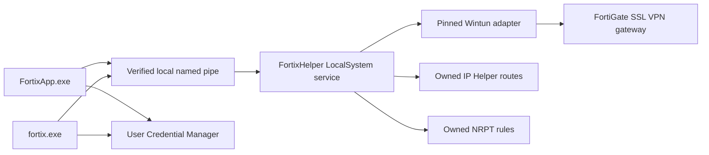

# Windows preview

Fortix supports Windows 10 22H2 and Windows 11 on x64. Windows arm64 is
compile-checked only, not a supported release target. This preview uses the
native password-only FortiGate SSL VPN backend.

## Download and verify

Download `fortix_0.3.0_windows_amd64.zip` and `checksums.txt` from the same tagged
release. Adjust the version to the release you selected. Put them in a new,
empty directory and verify the ZIP before extraction or elevation:

```powershell
$asset = 'fortix_0.3.0_windows_amd64.zip'
$entries = @(Get-Content .\checksums.txt | Where-Object {
    $_ -match ('^[a-f0-9]{64}  ' + [regex]::Escape($asset) + '$')
})
if ($entries.Count -ne 1) { throw 'Missing or ambiguous checksum entry' }
$expected = ($entries[0] -split '  ')[0]
$actual = (Get-FileHash -LiteralPath $asset -Algorithm SHA256).Hash
if ($actual -ne $expected) { throw 'Checksum mismatch: do not install' }
```

The ZIP contains `fortix.exe`, `fortix-helper.exe`, `FortixApp.exe`, `wintun.dll`,
`README.txt`, `LICENSE`, and `NOTICES.txt`. The desktop app is self-contained;
a separate .NET runtime installation is not required. Keep the whole extracted
folder together, including the pinned Wintun DLL.

The Fortix executables are unsigned in this preview. SmartScreen can show
**Windows protected your PC** or an unknown-publisher warning. A matching hash
checks the download against the manifest, not the publisher's identity: the
manifest is not independently signed. Only after reviewing the release source,
verifying the checksum, and deciding to trust the files should you use
**More info > Run anyway**, if Windows offers that per-file choice. Do not
disable SmartScreen globally or override an organization's security policy.
The bundled Wintun DLL is separately hash-checked and signature-verified.

## Install

1. Extract the verified ZIP into its own new folder.
2. Open PowerShell **as Administrator**, then change to that extracted folder.
3. Enroll the Windows account that will use Fortix:

   ```powershell
   .\fortix-helper.exe install --user $env:USERNAME
   ```

   If elevation uses a different administrator account, supply the intended
   user's account name instead of that administrator's `$env:USERNAME`.
4. Sign out and sign in again so the new `fortix` group membership is present in
   the account's access token.
5. As that user, launch `FortixApp.exe` or use `fortix.exe` from the extracted
   folder. The app can also request the first-run helper installation through
   UAC. Normal profile management and connection do not require running the
   desktop app as Administrator.

Installation places protected helper payloads in `%ProgramFiles%\Fortix` and
creates the `FortixHelper` LocalSystem service. Machine profiles, connection
state, and logs live under `%ProgramData%\Fortix`. Do not install another
unverified helper or change these directories' permissions to solve an error.

## Desktop and CLI

The desktop app provides a taskbar notification-area icon, a management window,
connect/disconnect actions, profile editing including excluded routes, logs,
shared-profile import/export, password remembering, and connection notifications.
The tray icon follows the taskbar theme. Use the app's normal quit action before
uninstalling; closing a management window is not a substitute for disconnecting.

The CLI uses the same profile format and helper protocol as the other platforms.
For example, from the extracted folder in a normal PowerShell session:

```powershell
.\fortix.exe profile validate .\work.json
.\fortix.exe profile add .\work.json
.\fortix.exe profile list
.\fortix.exe up work
.\fortix.exe status
.\fortix.exe logs work
.\fortix.exe down work
```

Shared drafts can be exported with `profile export work -o work.fortix.json` and
imported with `profile import work.fortix.json`. Passwords are not exported. See
[profiles](profiles.md) for route modes, domain lists, and the JSON fields.
Windows console prompts collect passwords without echoing them.

Windows does not support:

- The openfortivpn backend. Its refusal is exactly
  `openfortivpn is not available on Windows; use the native backend`.
- MFA profiles. The helper refuses them with exactly
  `MFA profiles are not available on Windows`. There is no automatic fallback to
  another backend; use an appropriate supported client for second-factor gateways.
- FortiClient configuration import. Import a shared Fortix profile or create one
  manually instead.
- The separate Go `fortix-tray` executable, Unix pinentry, or Unix service modes.
  Use `FortixApp.exe` for the Windows desktop.

## Routes, DNS, and recovery



Only traffic selected by the profile's route mode is directed into the tunnel.
Custom routes and exclusions allow a narrower selection than full routing.
Overlapping or conflicting network configuration can be refused instead of
silently replacing another connection's routes.

Split DNS uses Windows Name Resolution Policy Table (NRPT) rules for configured
VPN domains, rather than changing every adapter's DNS server. Queries for other
domains keep their normal policy. Existing conflicting effective NRPT policy is
refused. Full routing does not turn split DNS into global DNS, and Fortix is not
a kill switch or a universal DNS/leak-prevention guarantee.

Before changing adapters, routes, or DNS policy, the helper records what it owns.
Disconnect removes those owned resources. After a crash, service startup reads
that record and attempts cleanup, including DNS recovery when an adapter is
already gone. It does not adopt existing routes or remove modified foreign DNS
rules. If ownership or cleanup cannot be verified, recovery fails closed and
retains evidence rather than deleting unrelated network state.

## Security model

The helper runs as LocalSystem because adapter, route, and NRPT changes require
machine privileges. Its local control endpoint is `\\.\pipe\Fortix.Control.v1`,
restricted to SYSTEM, Administrators, and enabled members of the local `fortix`
group. Remote pipe clients are refused. Group membership grants access to
machine VPN management, so enroll only accounts trusted with that capability.

Clients verify the pipe server against the SCM `FortixHelper` service PID,
LocalSystem identity, and installed executable path before exchanging the
protocol greeting or credentials. The helper checks the connecting Windows
identity and binds password challenges to that identity and connection attempt.
Machine files use protected access controls; links and insecure paths are
rejected rather than followed.

Remembered passwords belong to the current user's Windows Credential Manager,
not the machine profile JSON or the helper's state directory. They use
`fortix:<id>:<sha256>:password` credential names shared by the desktop and CLI.
A profile's authentication identity change selects a different credential key.
Uninstalling machine state is not a promise to clear every user's saved
credentials. Review saved Fortix entries in Credential Manager separately.
Gateway certificate verification and explicit trust still apply; never accept
an unexpected certificate without independent confirmation. See
[security](security.md) for the shared gateway and credential boundaries; its
Unix socket and filesystem examples are not Windows installation paths.

## Uninstall

Disconnect every tunnel, quit `FortixApp.exe`, and open elevated PowerShell.
From the extracted release directory:

```powershell
.\fortix-helper.exe uninstall
```

This removes the verified helper installation and service while retaining
machine profiles/state and group membership. To remove retained machine state
and the installation's owned group or recorded enrollment as well:

```powershell
.\fortix-helper.exe uninstall --purge
```

The public uninstall command also works from the installed helper copy:

```powershell
& "$env:ProgramFiles\Fortix\fortix-helper.exe" uninstall
```

It securely stages a temporary uninstaller rather than deleting its own running
image directly. `--purge` is accepted from that copy too; some staged cleanup can
be deferred until reboot. After successful removal, delete the extracted release
folder. Do not manually delete protected installation files to bypass a failed
uninstall; preserve the reported error and retry after its cause is resolved.

## Logs and troubleshooting

Per-profile logs are `%ProgramData%\Fortix\logs\<id>.log`, with bounded rotated
files. Read them through the app's log window or `fortix.exe logs <id>` as an
authorized user. They are not public-readable files. Treat exported diagnostics
as potentially sensitive and review them before sharing.

- **Helper unavailable:** run `fortix-helper.exe status` and
  `Get-Service FortixHelper`. Check installation completed and the service is
  running. An interactive bare helper invocation does not start the service.
- **Access denied:** confirm the correct account was enrolled, then sign out and
  sign in. Do not broaden the pipe or directory ACLs.
- **Server verification failed:** stop and inspect the service installation;
  do not disable verification or connect to a replacement pipe server.
- **Wintun verification failed:** retain `wintun.dll` from the same verified ZIP.
  Do not substitute a DLL from another download or disable its hash/signature check.
- **Route or DNS policy conflict:** inspect other VPNs and managed NRPT policies.
  Disconnect a conflicting VPN or ask the network administrator; do not delete
  another product's routes or DNS rules blindly.
- **Recovery or uninstall refused:** keep the ownership records and diagnostics.
  Reboot if staged cleanup was deferred, then retry the supported command.
- **MFA refused:** this is a preview limitation, not a missing password or service
  permission. Windows native connections are password-only.

## winget status

Release packaging can generate winget manifests for the ZIP's portable CLI,
helper aliases, and desktop executable. Submission is pending; this preview is
not claimed to be available from the public winget catalog. Use the verified ZIP
installation above until submission and a human Windows validation are complete.
